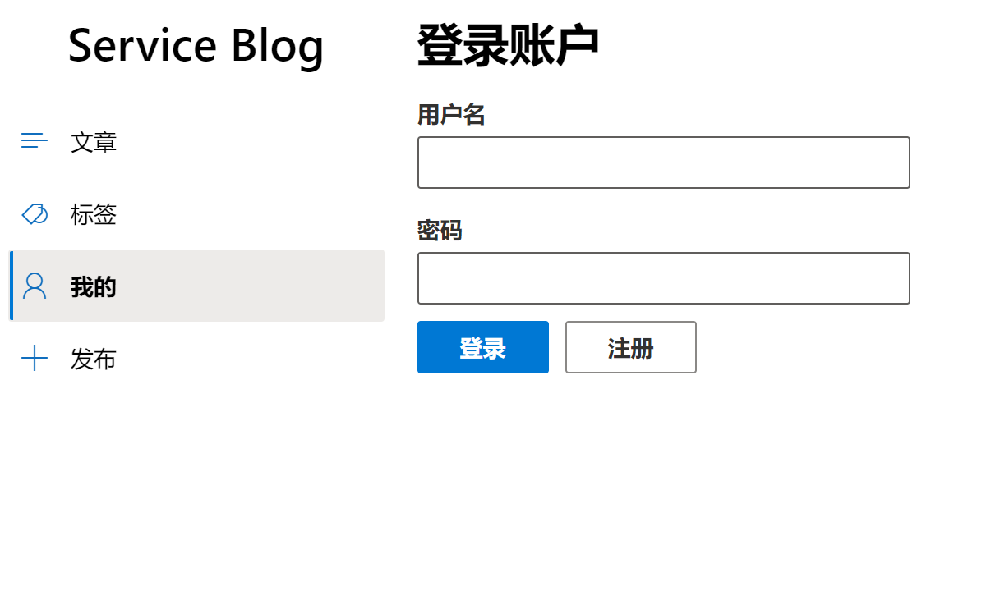
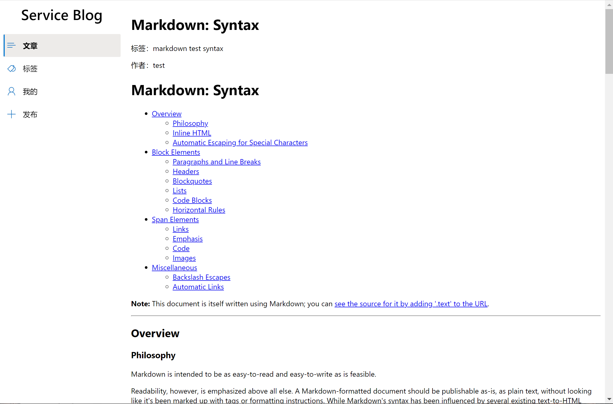
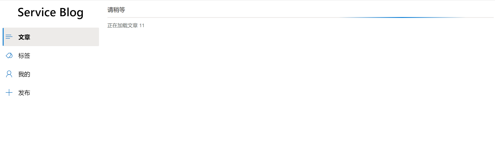

# 服务计算项目个人小结

| 课程名称 | 服务计算 |   任课老师   |       潘茂林       |
| :------: | :----------: | :----------: | :----------------: |
|   年级   |    2018级    | 专业（方向） |    软件工程专业    |
|   学号   |   17364025   |     姓名     |       贺恩泽      |
|   电话   | 13709283280  |    Email     | hez2010@outlook.com |
| 开始日期 |  2020.12.15  |   完成日期   |     2020.12.22     |


## 完成内容
### 完成工作
+ 一、搭建前端基础设施和总体布局
+ 二、后端 JWT 认证和 Token 签发
+ 三、博客详情页面

### 显示效果
#### 网站布局
总体布局为左侧导航栏，右侧显示内容：



#### 博客详情
博客详情支持 Markdown 渲染：


数据为加载完成前显示进度条：


## 部分重要的代码解释
### 前端部分
总体前端框架选用 React，并使用 yarn 作为包管理器，parcel 作为打包工具，UI 库使用 fluentui。

首先定义全局状态用于保存当前用户信息和导航栏选中项目：
```tsx
export interface Context {
  user?: UserInfo;
  setUser?: (userInfo?: UserInfo) => void;
  selectedKey?: string;
  setSelectedKey?: (key?: string) => void;
}

// 通过 createContext 创建 Context
const AppContext = React.createContext<Context>({});
```

然后设计总体的布局：

```tsx
const Layout: React.FunctionComponent = (props) => {
  // 获取全局状态
  const { selectedKey, setSelectedKey } = React.useContext(AppContext);

  // 中间略

  // 返回导航栏布局
  return <>
    <Stack horizontal={true}>
      <Stack.Item styles={{ root: { width: "20%", minWidth: 200 } }}>
        <Text variant="xxLarge" block nowrap style={{ textAlign: "center" }}>Service Blog</Text>
        <div className="nav-menu" style={{ paddingTop: 20 }}>
          <Nav linkAs={renderLink} groups={navItems} selectedKey={selectedKey} />
        </div>
      </Stack.Item>
      <Stack.Item styles={{ root: { paddingLeft: 20, width: "80%" } }} align="stretch">
        {props.children}
      </Stack.Item>
    </Stack>

  </>;
};
```

然后定义前端路由，并在页面加载时获取用户信息：

```tsx
const App: React.FunctionComponent = () => {
  const [user, setUser] = React.useState<UserInfo>();
  const [selectedKey, setSelectedKey] = React.useState<string>();
  const userInfoRequest = useHttp<UserInfo>("/api/user/self", "GET");

  // 如果请求状态发生变化
  React.useEffect(() => {
    // 如果已经获取到响应数据
    if (userInfoRequest.data && !userInfoRequest.loading) {
      setUser(userInfoRequest.data);
    }
  }, [userInfoRequest.data, userInfoRequest.loading]);
  // 加载后获取用户信息
  React.useEffect(() => {
    userInfoRequest.fire();
  }, []);

  // 定义路由，并将内容包含在 Context 中，以允许子组件获取全局状态
  return (
    <AppContext.Provider value={{ user, setUser, selectedKey, setSelectedKey }}>
      <Router>
        <Layout>
          <Switch>
            <Route exact path="/">
              <Home />
            </Route>
            // 后续略
          </Switch>
        </Layout>
      </Router>
    </AppContext.Provider>
  );
};
```

上述使用的 `useHttp` 是通过 React Hooks 对 `fetch` 进行的封装：

```tsx
import { useState } from "react";

// eslint-disable-next-line @typescript-eslint/explicit-module-boundary-types
export default function useHttp<T>(endpoint: string, method?: "POST" | "PATCH" | "PUT" | "DELETE" | "GET") {
  // 定义各种状态：响应数据、错误信息、状态码和是否正在加载等等
  const [data, setData] = useState<T>();
  const [loading, setLoading] = useState(false);
  // eslint-disable-next-line @typescript-eslint/no-explicit-any
  const [error, setError] = useState<any>();
  const [status, setStatus] = useState(0);
  const [ok, setOk] = useState(true);
  const [responseHeaders, setResponseHeaders] = useState<Headers>();

  // 请求函数
  // eslint-disable-next-line @typescript-eslint/no-explicit-any
  const fire = (body?: any, json = true, overwriteUrl?: string, headers: HeadersInit = {}): void => {
    // 设置请求前状态
    setLoading(true);
    setOk(false);
    setStatus(0);
    const request: RequestInit = {
      method,
      body: json ? JSON.stringify(body) : body,
      credentials: "include",
      headers: json ? { "Content-Type": "application/json", ...headers } : headers
    };
    fetch(overwriteUrl ? overwriteUrl : endpoint, request).then(res => {
      // 根据响应更新状态
      setResponseHeaders(res.headers);
      setOk(res.ok);
      setStatus(res.status);
      return res.json();
    }).then(json => {
      // 更新响应数据
      setData(json);
      setLoading(false);
    }).catch(err => {
      // 更新错误信息
      setData(undefined);
      setError(err);
      setLoading(false);
    });
  };

  return {
    fire,
    data,
    loading,
    error,
    headers: responseHeaders,
    status,
    ok
  };
}
```

详情页面则通过路由参数拿到文章的 ID，然后向后端发送请求获取文章：

```tsx
interface DetailsRouteParam {
  id?: string;
}

const Details: React.FunctionComponent = () => {
  // 获取路由参数
  const { id } = useParams<DetailsRouteParam>();
  const { setSelectedKey } = React.useContext(AppContext);
  const [content, setContent] = React.useState<BlogContent>();
  // 创建 GET 请求
  const detailsRequest = useHttp<{ status: string, data: BlogContent; }>(`/api/details/${id}`, "GET");
  // 如果请求状态发生改变
  React.useEffect(() => {
    if (!detailsRequest.loading) {
      if (detailsRequest.data) {
        // 如果加载成功
        if (detailsRequest.data.status === "success") {
          setContent(detailsRequest.data.data);
        }
      }
      // 否则弹出失败
      if (detailsRequest.error) {
        alert("加载失败");
      }
    }
  }, [detailsRequest.data, detailsRequest.ok, detailsRequest.loading]);
  // 发起请求
  React.useEffect(() => {
    setSelectedKey && setSelectedKey("home");
    detailsRequest.fire();
  }, []);

  // 使用 react-markdown 渲染文章内容，并且在文章加载完之前使用一个进度条来向用户表示当前正在加载
  return <>
    {
      content ? <>
        <h1>{content.title}</h1>
        <p>标签：{content.tags?.map((v, i) => <span key={i}>{v}&nbsp;</span>)}</p>
        <p>作者：{content.author}</p>
        <ReactMarkdown plugins={[gfm]}>{content.text}</ReactMarkdown>
      </> :
        <ProgressIndicator label="请稍等" description={`正在加载文章 ${id}`} />
    }
  </>;
};
```

### 后端部分
后端利用 gin 完成 Web API 的开发，并借助 jwt-go 实现基于 JWT Token 的认证。

定义路由：
```go
// 创建路由分组
v1 := r.Group("/user")

// 根据分组设置路由
{
    v1.POST("/login", Login)
    v1.POST("/register", Register)
    v1.GET("/self", Self)
    v1.POST("/logout", Logout)
    // ... 略
}
r.GET("/details/:id", Details)
```

JWT Token 签发和验证：
```go
var (
    // 盐
	Secret     = "service-computing-blogs"
	ExpireTime = 3600
)

// JWT Claims 中存放的数据
type JWTClaims struct {
	jwt.StandardClaims
	UserId   int64  `json:"userid"`
	Password string `json:"password"`
	UserName string `json:"username"`
	Email    string `json:"email"`
}

func getToken(claims *JWTClaims) (string, error) {
    // 创建新的 JWT Claims
    token := jwt.NewWithClaims(jwt.SigningMethodHS256, claims)
    // 对 Token 签名
	signedToken, err := token.SignedString([]byte(Secret))
	if err != nil {
		return "", err
	}
	return signedToken, nil
}

func verifyToken(strToken string) (*JWTClaims, error) {
    // Parse JWT Token
	token, err := jwt.ParseWithClaims(strToken, &JWTClaims{}, func(token *jwt.Token) (interface{}, error) {
		return []byte(Secret), nil
	})
	if err != nil {
		return nil, err
    }
    // 将数据写入 JWT Claims
	claims, ok := token.Claims.(*JWTClaims)
	if !ok {
		return nil, err
	}
	if err := token.Claims.Valid(); err != nil {
		return nil, err
	}
	return claims, nil
}
```

用户登录后，根据用户的数据签发 JWT Token：
```go
// 根据用户信息创建 Claims
claims := &JWTClaims{
    UserId:   id,
    UserName: loginInfo.UserName,
    Password: loginInfo.Password,
    Email:    email,
}
// 设置签发时间
claims.IssuedAt = time.Now().Unix()
// 设置过期时间
claims.ExpiresAt = time.Now().Add(time.Second * time.Duration(ExpireTime)).Unix()
signedToken, _ := getToken(claims)
// 下发 Token
c.SetCookie("jwt-token", signedToken, 3600, "/", "", false, true)
```

用户退出后，清除 Token：

```go
func Logout(c *gin.Context) {
	c.SetCookie("jwt-token", "", 0, "/", "", false, true)

	c.JSON(http.StatusOK, gin.H{
		"status": "success",
	})
}
```

用户获取自身信息时，根据 JWT Token 拿到用户信息后返回：

```go
func Self(c *gin.Context) {
    // 读入 JWT Token
    strToken, err := c.Cookie("jwt-token")
    // 验证 Token
	claims, err := verifyToken(strToken)
	if err != nil {
		c.String(401, err.Error())
		return
    }
    // 延长有效期并重新签名
	claims.ExpiresAt = time.Now().Unix() + (claims.ExpiresAt - claims.IssuedAt)
	signedToken, err := getToken(claims)
	if err != nil {
		c.String(500, err.Error())
		return
	}
    // 下发新的 Token
	c.SetCookie("jwt-token", signedToken, 3600, "/", "", false, true)
    // 返回用户数据
	c.JSON(http.StatusOK, gin.H{
		"name":  claims.UserName,
		"email": claims.Email,
		"id":    claims.UserId,
	})
}
```

获取文章详情：
```go
func Details(c *gin.Context) {
	status := "success"
	var blogID int
	var title string
	var text string
	var username string
	var email string
	var authorID int
    // 获取路由参数中的文章 ID
	id, covErr := strconv.Atoi(c.Param("id"))
	if covErr != nil {
		status = "param error"
		c.JSON(http.StatusOK, gin.H{
			"data":   nil,
			"status": status,
		})
		return
	} else {
        // 查询出文章的信息
		err := Db.QueryRow("SELECT blog.blog_id,blog.title,blog.text,blog.author_id,user.username,user.email FROM blog,user WHERE blog.blog_id = ? and blog.author_id=user.user_id", id).Scan(&blogID, &title, &text, &authorID, &username, &email)
		if err != nil {
			status = fmt.Sprintf("%s", err)
        }
        // 根据文章 ID 查询出文章的 Tags
		rows, err := Db.Query("SELECT `t0`.`tag_name` FROM `tag_blog` AS `t` LEFT JOIN `tag` AS `t0` ON `t`.`tag_id` = `t0`.`tag_id` WHERE `t`.`blog_id` = ?", id)
		if err != nil {
			status = fmt.Sprintf("%s", err)
        }
        // 将查询出的 Tags 作为一个字符串数组
		var tags []string
		for rows.Next() {
			var tagname string
			rows.Scan(&tagname)
			tags = append(tags, tagname)
		}
        // 返回数据
		c.JSON(http.StatusOK, gin.H{
			"data": gin.H{
				"id":          blogID,
				"title":       title,
				"text":        text,
				"author":      username,
				"authorEmail": email,
				"authorId":    authorID,
				"tags":        tags,
			},
			"status": status,
		})
	}
}
```

## 遇到的部分问题与解决方法
1. fluentui 默认的 `Nav` 无法正常配合 React 的 `NavLink` 进行页面跳转。解决方法：利用 `RenderAs` 重写生成的导航按钮。
2. 查询文章的 Tags 时，一开始使用多句 `JOIN` 进行查询，由于是一对多，每一个标签都会导致一行查询结果，一篇文章如果没有标签还会导致没有查询结果，数据处理起来很麻烦。解决方法：将查询文章信息和标签信息分成两次查询。

## 心得
1. 本次实践了利用 React Hooks 编写纯函数式组件构成的前端项目，不同于 Vue、Angular 等模板渲染类的前端框架，React 给予了开发人员非常大的自由度，同时单向数据流确保了性能和可控。
2. 通过本次项目试验了 Parcel 取代 Webpack 构建前端项目。
3. 实践了 Go RESTful API 的编写，并编写 SQL 进行了数据库相关的操作，学会了利用 Go 语言进行 Web API 的开发。
4. 经过本次项目还学会了 JWT Token 的原理和使用方法，利用 JWT Token 可以很简单和安全地传递用户凭据信息，同时无需后端为用户维护 session，非常方便。
5. 实践了前后端分离的开发模式，体会到了该模式的优点：前后端开发完全解耦，通过数据进行交互，利于项目的工程化并提升可维护性。
