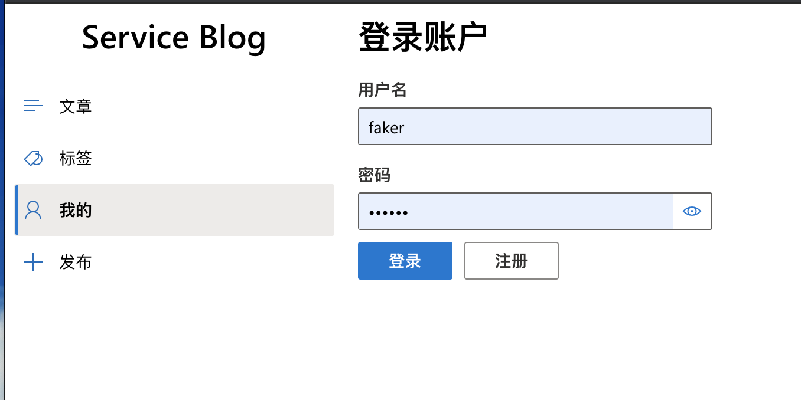
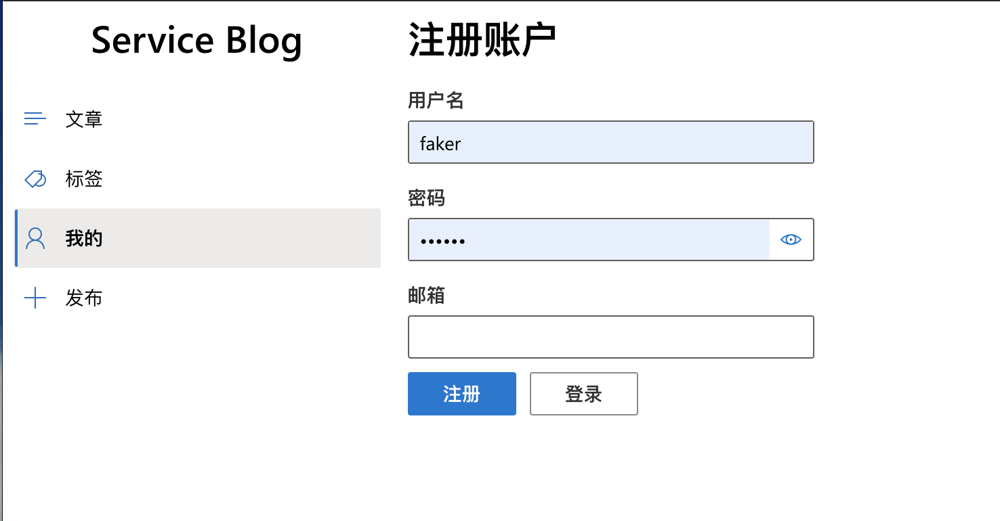
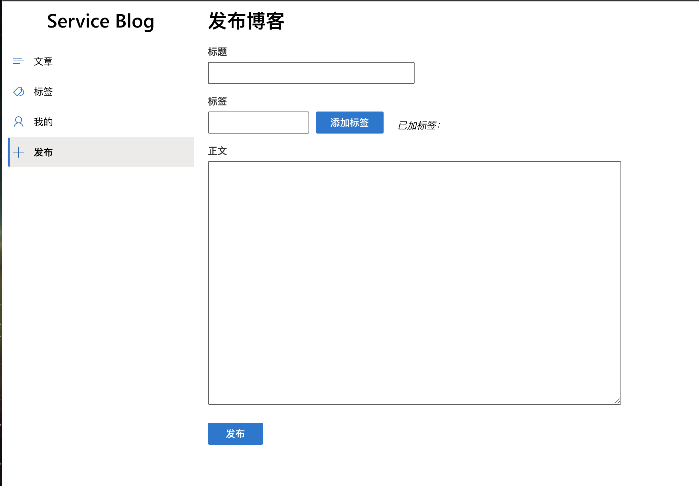

# 服务计算hw9项目小结

| 课程名称 | 服务计算 |   任课老师   |       潘茂林       |
| :------: | :----------: | :----------: | :----------------: |
|   年级   |    2018级    | 专业（方向） |    软件工程专业    |
|   学号   |   18308008   |     姓名     |       车春江      |
|   电话   | 13432921506  |    Email     | skt.faker.ccj@gmail.com |
| 开始日期 |  2020.12.15  |   完成日期   |     2020.12.22     |

## 完成内容
### 完成工作

* **参与**登陆/注册页面的前后端开发
* 发布页面(POST页面)的前端开发
* 参与gin后端框架的构建

### 显示内容

登陆界面：



注册页面：



发布博客页面：



### 前端开发

#### 登陆界面

##### UI

前端使用react进行开发，其中login界面的关键代码为：

```
const Content = <Stack>
    <Stack.Item>
      <Text variant="xxLarge">登录账户</Text>
    </Stack.Item>
    <Stack.Item styles={{ root: { paddingTop: 10, width: 300 } }}>
      <TextField label="用户名" defaultValue={name} onChange={(_, v) => setName(v)} />
    </Stack.Item>
    <Stack.Item styles={{ root: { paddingTop: 10, width: 300 } }}>
      <TextField label="密码" canRevealPassword={true} type="password" defaultValue={password} onChange={(_, v) => setPassword(v)} />
    </Stack.Item>
    <Stack.Item styles={{ root: { paddingTop: 10, width: 300 } }}>
      <Stack horizontal>
        <Stack.Item>
          <PrimaryButton text="登录" onClick={login} />
        </Stack.Item>
        <Stack.Item styles={{ root: { paddingLeft: 10 } }}>
          <DefaultButton text="注册" onClick={() => setType("register")} />
        </Stack.Item>
      </Stack>
    </Stack.Item>
    {
      error && <Stack.Item styles={{ root: { paddingTop: 10, width: 300 } }}>
        <p style={{ color: "red" }}>{error}</p>
      </Stack.Item>
    }
  </Stack >;

  return type === "register" ? <Register setType={setType} /> : Content;
```

其中`return`后面的语句是决定页面返回的内容，我们首先判断`type`是否等于`register`，如果是的话，我们返回注册页面，否则我们返回以上的`Content`内容

##### http请求
当我们点击登陆按钮的时候，发起一个POST请求：

```
const login = () => {
    loginRequest.fire({
      username: name,
      password: password
    });
    setType("login");
  };
```

http请求被封装在`useHttp`方法中，我们可以通过以下方法定义一个http请求：

```
const loginRequest = useHttp<{ status: string; }>("/api/user/login", "POST");
```

当我们执行`loginRequest.fire`，会通过API`"/api/user/login"`向后端服务器发送一个POST请求，将username和password发送给后端服务器，然后后端服务器再根据username和password去数据库里面核验，并返回状态，我们再根据状态来做出对应的操作：

```
React.useEffect(() => {
    if (!loginRequest.loading) {
      if (loginRequest.data?.status === "success") {
        userInfoRequest.fire();
        setError(undefined);
      }
      else if (loginRequest.data || !loginRequest.ok) {
        setError("登录失败");
        alert("密码或者账户名错误");
      }
      setType("not defined");
    }
  }, [loginRequest.loading, loginRequest.data, loginRequest.ok]);
```

我们再根据`error`的值来返回前端的组件：

```
{
      error && <Stack.Item styles={{ root: { paddingTop: 10, width: 300 } }}>
        <p style={{ color: "red" }}>{error}</p>
      </Stack.Item>
    }
```

#### 注册界面

##### UI

注册页面的关键代码为：

```
return <Stack>
    <Stack.Item>
      <Text variant="xxLarge">注册账户</Text>
    </Stack.Item>
    <Stack.Item styles={{ root: { paddingTop: 10, width: 300 } }}>
      <TextField label="用户名" defaultValue={name} onChange={(_, v) => setName(v)} />
    </Stack.Item>
    <Stack.Item styles={{ root: { paddingTop: 10, width: 300 } }}>
      <TextField label="密码" canRevealPassword={true} type="password" defaultValue={password} onChange={(_, v) => setPassword(v)} />
    </Stack.Item>
    <Stack.Item styles={{ root: { paddingTop: 10, width: 300 } }}>
      <TextField label="邮箱" type="email" defaultValue={email} onChange={(_, v) => setEmail(v)} />
    </Stack.Item>
    <Stack.Item styles={{ root: { paddingTop: 10, width: 300 } }}>
      <Stack horizontal>
        <Stack.Item>
          <PrimaryButton text="注册" onClick={(register)} />
        </Stack.Item>
        <Stack.Item styles={{ root: { paddingLeft: 10 } }}>
          <DefaultButton text="登录" onClick={() => props.setType("login")} />
        </Stack.Item>
      </Stack>
    </Stack.Item>
    {
      error && <Stack.Item styles={{ root: { paddingTop: 10, width: 300 } }}>
        <p style={{ color: "red" }}>{error}</p>
      </Stack.Item>
    }
  </Stack >;
```

注册界面的前端实现与登陆界面的基本一致

##### http请求

与登陆界面类似，我们点击登陆界面的时候会将username,password和email POST到后端服务器中：

```
const register = () => {
    registerRequest.fire({
      username: name,
      password: password,
      email: email
    });
  };
```

然后根据拿到的response做相应的处理：

```
React.useEffect(() => {
    if (!registerRequest.loading) {
      if (registerRequest.data?.status === "success") {
        console.log("注册成功");
        userInfoRequest.fire();
        setError(undefined);
      }
      else if (registerRequest.data || !registerRequest.ok) {
        setError("注册失败");
      }
    }
  }, [registerRequest.loading, registerRequest.data, registerRequest.ok]);
```

#### 发布页面

##### UI

在登陆之前返回的react组件为：

```
const BeforePost =
    <Stack>
      <Stack.Item>
        <Text variant="xxLarge">发布博客</Text>
      </Stack.Item>
      <Stack.Item styles={{ root: { paddingTop: 10, width: 300 } }}>
        <TextField label="标题" onChange={(_, v) => setTitle(v)} />
      </Stack.Item>
      <Stack.Item styles={{ root: { paddingTop: 10, width: 1000 } }}>
        <Stack horizontal>
          <Stack.Item>
            <TextField value={currTags} label="标签" onChange={(_, v) => setCurrTags(v)} />
          </Stack.Item>
          <Stack.Item styles={{ root: { paddingLeft: 10, paddingTop: 30 } }}>
            <PrimaryButton text="添加标签" onClick={() => {
              if (currTags) {
                setTags([...tags, currTags]);
                setCurrTags("");
              }
            }} />
          </Stack.Item>
          <Stack.Item styles={{ root: { paddingTop: 40, paddingLeft: 20 } }}>
            <i>已加标签：</i>
            {
              tags.map(
                (tag, index) => {
                  return <i key={index}>{" " + tag}</i>;
                }
              )
            }
          </Stack.Item>
        </Stack>
      </Stack.Item>
      <Stack.Item styles={{ root: { paddingTop: 10, width: 600, height: 400 } }}>
        <TextField label="正文" multiline rows={20} onChange={(_, v) => setText(v)} />
      </Stack.Item>
      <Stack.Item styles={{ root: { paddingTop: 10, width: 300 } }}>
        <PrimaryButton text="发布" onClick={post} />
      </Stack.Item>
      {
        (type === "not login" || type === "failure") && <Stack.Item styles={{ root: { paddingTop: 10, width: 300 } }}>
          <p style={{ color: "red" }}>{type}</p>
        </Stack.Item>
      }
    </Stack>;
```

上述react组件中主要有以下几个部分：

* 标题：TextFile
* 标签：TextFile + PrimartButton
* 文本框：TextFile
* 发布按钮：PrimaryButton

当我们点击添加标签的按钮时，会将当前文本框的string加入到tags数组中，并且清空文本框的内容：

```
<PrimaryButton text="添加标签" onClick={() => {
              if (currTags) {
                setTags([...tags, currTags]);
                setCurrTags("");
              }
            }} />    
```


然后我们可以用以下方法将它显示出来：

```
<Stack.Item styles={{ root: { paddingTop: 40, paddingLeft: 20 } }}>
            <i>已加标签：</i>
            {
              tags.map(
                (tag, index) => {
                  return <i key={index}>{" " + tag}</i>;
                }
              )
            }
          </Stack.Item>
```

##### http请求

点击发布按钮的时候，触发以下函数：

```
const post = () => {
    fetch(postUrl, {
      method: "POST",
      credentials: "include",
      headers: { "Content-Type": "application/json" },
      body: JSON.stringify({ title: title, author_id: user ? user.id : -1, tags: tags, text: text })
    }).then(res => res.json()).then(data => {
      console.log(data);
      setType(data["status"]);
    });
  };
```

与登陆/注册界面的http请求不同，这里使用fetch函数来发起POST请求，将title,author_id,tags和text等数据发送到后端服务器上，然后根据返回的data中的status字段来决定返回的组件：

```
return user ? type === "success" ? AfterPost : BeforePost : <p>请先登录</p>;
```

### 后端开发

#### 登陆

处理登陆请求的函数为：

```
func Login(c *gin.Context) {
	var loginInfo loginModel
	c.Bind(&loginInfo)

	var id int64
	var email string
	status := "not defined"
	err := Db.QueryRow("select user_id, email from user where username = ? and password = ?", loginInfo.UserName, loginInfo.Password).Scan(&id, &email)
	if err != nil {
		if err == sql.ErrNoRows { //如果未查询到对应字段则...
			status = "not found"
			fmt.Println("not found")
		} else {
			status = "failure"
			fmt.Println("failue")
			log.Fatal(err)
		}
	} else {
		status = "success"
	}

	claims := &JWTClaims{
		UserId:   id,
		UserName: loginInfo.UserName,
		Password: loginInfo.Password,
		Email:    email,
	}
	claims.IssuedAt = time.Now().Unix()
	claims.ExpiresAt = time.Now().Add(time.Second * time.Duration(ExpireTime)).Unix()
	signedToken, _ := getToken(claims)
	c.SetCookie("jwt-token", signedToken, 3600, "/", "", false, true)

	c.JSON(http.StatusOK, gin.H{
		"status": status,
	})
}
```

核心方法就是使用sql语句到数据库里面找，如果有匹配username和password和用户的话，返回{status:success}给前端

#### 注册

核心代码为

```
func Register(c *gin.Context) {
	var registerInfo registerModel
	c.Bind(&registerInfo)

	result, err := Db.Exec("insert into user (username, password, email) values (?,?,?);", registerInfo.UserName, registerInfo.Password, registerInfo.Email)
	var id int64
	if err != nil {
		fmt.Println("err:%s", err)
	} else {
		id, _ = result.LastInsertId()
	}

	claims := &JWTClaims{
		UserId:   id,
		UserName: registerInfo.UserName,
		Password: registerInfo.Password,
		Email:    registerInfo.Email,
	}
	claims.IssuedAt = time.Now().Unix()
	claims.ExpiresAt = time.Now().Add(time.Second * time.Duration(ExpireTime)).Unix()
	signedToken, err := getToken(claims)
	c.SetCookie("jwt-token", signedToken, 3600, "/", ".", false, true)
	c.JSON(http.StatusOK, gin.H{
		"status": "success",
	})
}
```

核心方法便是忘数据库里面写数据，这里懒得做各种错误处理，直接返回success

#### 发布

核心代码为：

```
func Post(c *gin.Context) {
	// var blogInfo blogModel
	// c.ShouldBind(&blogInfo)
	// fmt.Println("title:", blogInfo.title)
	// fmt.Println("author:", blogInfo.author)
	// fmt.Println("tags:", blogInfo.tags)
	// fmt.Println("text:", blogInfo.text)

	data, _ := ioutil.ReadAll(c.Request.Body)
	blogInfo := make(map[string]interface{})
	if err := json.Unmarshal(data, &blogInfo); err != nil {
		fmt.Println("error")
	}

	title := blogInfo["title"]
	author_id := blogInfo["author_id"]
	tags := blogInfo["tags"].([]interface{})
	text := blogInfo["text"]

	fmt.Println("title:", title)
	fmt.Println("author_id:", author_id)
	fmt.Print("tags:")

	for i := 0; i < len(tags); i++ {
		fmt.Print(" ", tags[i])
	}
	fmt.Println()
	fmt.Println("text:", text)

	if author_id.(float64) <= 0 {
		fmt.Println("not login")
		c.JSON(http.StatusOK, gin.H{
			"status": "not login",
			"Data":   nil,
		})
		return
	}

	result, err := Db.Exec("insert into blog (author_id, title, text) values (?,?,?);", author_id, title, text)
	var blog_id int64
	if err != nil {
		fmt.Println("err:%s", err)
		c.JSON(http.StatusOK, gin.H{
			"status": "failure",
			"Data":   nil,
		})
		return
	} else {
		blog_id, _ = result.LastInsertId()
	}

	for i := 0; i < len(tags); i++ {
		tag := tags[i]
		var tag_id int64
		err = Db.QueryRow("select tag_id from tag where tag_name = ?", tag).Scan(&tag_id)
		if err != nil {
			if err == sql.ErrNoRows { //如果未查询到对应字段则...
				result, err = Db.Exec("insert into tag (tag_name) values (?);", tag)
				fmt.Println("tag not found, insert into databse")
				if err != nil {
					fmt.Println("err:%s", err)
					c.JSON(http.StatusOK, gin.H{
						"status": "failure",
						"Data":   nil,
					})
					return
				} else {
					tag_id, _ = result.LastInsertId()
				}
			} else {
				fmt.Println("failue")
				log.Fatal(err)
				c.JSON(http.StatusOK, gin.H{
					"status": "failure",
					"Data":   nil,
				})
				return
			}
		}
		result, err = Db.Exec("insert into tag_blog (tag_id, blog_id) values (?,?);", tag_id, blog_id)
		if err != nil {
			fmt.Println("err%s", err)
			c.JSON(http.StatusOK, gin.H{
				"status": "failure",
				"Data":   nil,
			})
			return
		}
	}

	c.JSON(http.StatusOK, gin.H{
		"status": "success",
		"Data": map[string]interface{}{
			"blog_id": blog_id,
		},
	})

}
```

核心方法与登陆/注册页面一样，但是逻辑要复杂一些，主要需要处理以下逻辑：

* 先把author_id,title,text插入blog表中
* 然后对于tags数组中的每一个tag:
  * 判断tag表中有没有这个tag，如果没有则插入tag表中拿到新的tag_id，如果有的话拿到对应的tag_id
  * 将tag_id,blog_id插入tag_blog表中

这样子我们按tags拉取博客的时候，可以很方便拿到对应的blog_id进而拿到对应的blog数据

## 遇到的问题和解决办法


在处理http请求的时候，会遇到前端发送的数据后端接收不到的问题，我们用下面方法发送POST请求：

```
  const post = () => {
    fetch(postUrl, {
      method: "POST",
      credentials: "include",
      headers: { "Content-Type": "application/json" },
      body: JSON.stringify({ title: title, author_id: user ? user.id : -1, tags: tags, text: text })
    }).then(res => res.json()).then(data => {
      console.log(data);
      setType(data["status"]);
    });
  };
```

在后端我们如果用以下方法来获取POST参数的时候，会发生以上问题

```
var blogInfo blogModel
c.ShouldBind(&blogInfo)
fmt.Println("title:", blogInfo.title)
fmt.Println("author:", blogInfo.author)
fmt.Println("tags:", blogInfo.tags)
fmt.Println("text:", blogInfo.text)
```

这时候print出来的都是空的，经过查找资料和调试，发现可以通过以下办法来解决：

```
	data, _ := ioutil.ReadAll(c.Request.Body)
	blogInfo := make(map[string]interface{})
	if err := json.Unmarshal(data, &blogInfo); err != nil {
		fmt.Println("error")
	}

	title := blogInfo["title"]
	author_id := blogInfo["author_id"]
	tags := blogInfo["tags"].([]interface{})
	text := blogInfo["text"]

	fmt.Println("title:", title)
	fmt.Println("author_id:", author_id)
	fmt.Print("tags:")

```

方法是首先用`ioutil.ReadAll`方法拿到json数据，然后用`unmarshal`来将json字段映射到一个map中，这样我们可以通过访问map来拿到对应的POST参数

## 个人心得

* `react`框架可以让我们不用处理HTML文件和CSS文件，从而快速地构建前端应用
* `gin`框架可以让我们比较方便地处理POST请求和GET请求，并且可以快速地链接上数据库和方便的对数据库进行操作
* `navicat`软件对数据库进行了可视化，提供了一个图形化界面然后我们方便地进行建表等操作
* 在这次作业中深深地体会到了团队合作的重要性，充分进行沟通是完成项目的关键

