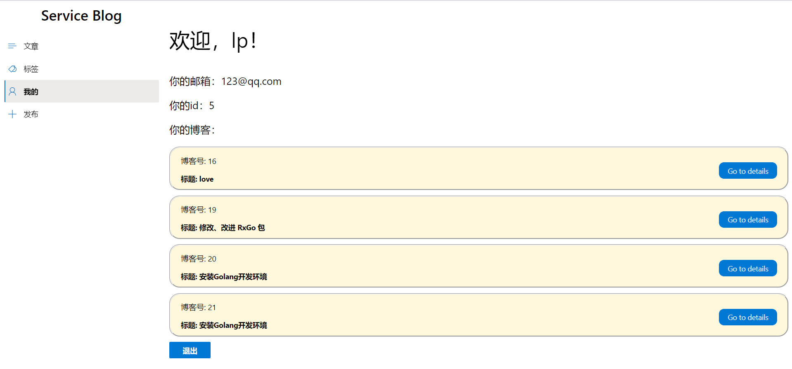

# 博客页面服务端与客户端项目开发小结      
## 个人分工       
本次项目中我负责个人主页的前后端开发，实现的效果是登陆后展示用户的id，邮箱以及发布的所有博客的列表，并且简单的设计了一下样式。  

## 界面展示      
 

## 前端实现思路       
给后端发起POST请求，发送user_id过去，拿到后端在数据库查询到的用户的博客列表，然后用博客列表生成list。     
```
React.useEffect(() => {
    setSelectedKey && setSelectedKey("portal");
    fetch("/api/user/portal", {
      method: "POST",
      credentials: "include",
      headers: { "Content-Type": "application/json" },
      body: JSON.stringify({ author_id: user?.id })
    })
      .then(res => {
        if (!res.ok) {
          throw "failed to fetch";
        }
        return res.json();
      })
      .then(data => {

        console.log(data);
        setList(data.result);

      })
      .catch(err => {
        alert(err);
      });
  }, [user]);
```
返回值首先返回用户id和邮箱，然后使用map函数依次迭代list中的每个元素，将每篇博客作为一个Stack.Item呈现在页面中。点击每篇博客的详情按钮时，使用**NavLink，to**跳转到此博客的详情页面。       
```
return user ? <>
    <p style={{fontSize: 40}}>欢迎，{user.name}！</p>
    <p style={{fontSize: 20}}>你的邮箱：{user.email}</p>
    <p style={{fontSize: 20}}>你的id：{user.id}</p>
    <p style={{fontSize: 20}}>你的博客：</p>
    <Stack>
      {
        list?.map((v, i) => {
          return <Stack.Item key={i} styles={{ root: { paddingLeft: 20, height: 80, borderRadius: 20, marginBottom: 10, borderStyle: "groove",  backgroundColor : "cornsilk"} }}>
            <p style={{fontSize: 15}}>博客号: {v.id}</p>
            <p style={{fontWeight: "bold"}}>标题: {v.title}</p>
            <PrimaryButton style={{position: "relative", top: -55, right: 20, borderRadius: 10, float: "right"}}>
              <NavLink style={{ textDecoration: "none", color: "white" }} to={`/details/${v.id}`}>Go to details</NavLink>
            </PrimaryButton>
          </Stack.Item>;
        })
      }
    </Stack>
    <PrimaryButton text="退出" onClick={logout} />

  </> : <Login />;
```

## 后端实现思路      
自定义结构体blog：
```
type Blog struct {
	Id    int    `json:"id"`
	Title string `json:"title"`
}
```
根据分组设置路由，保证前端POST发来的数据能到正确的函数中被处理：
```
{
    v1.POST("/login", Login)
    v1.POST("/register", Register)
    v1.GET("/self", Self)
    v1.POST("/logout", Logout)
    v1.POST("/post", Post)
    v1.GET("/tags", Tags)
    v1.POST("/portal", MY)
}
```
取到user_id后，根据user_id在数据库中用sql语句查询，得到该用户的所有博客信息后储存在blog类型的数组中，然后返回含有该blog数组的JSON给前端：      
```
func MY(c *gin.Context) {
	var id myID
	c.BindJSON(&id)
	// id, err := strconv.Atoi(c.PostForm("author_id"))
	// if err != nil {
	// 	print(err)
	// }
	print("id is:", id.AuthorID)
	blogs, err := getMY(id.AuthorID)
	if err != nil {
		log.Fatal(err)
	}
	//H is a shortcut for map[string]interface{}
	c.JSON(http.StatusOK, gin.H{
		"result": blogs,
		"count":  len(blogs),
	})
}
```      
## 心得       
- 初步了解了React框架        
- 初步了解了Gin框架
- 回顾了CSS样式
- 了解了前后端的分工