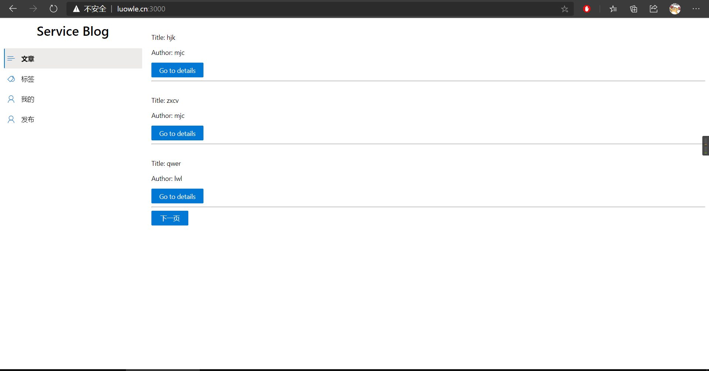
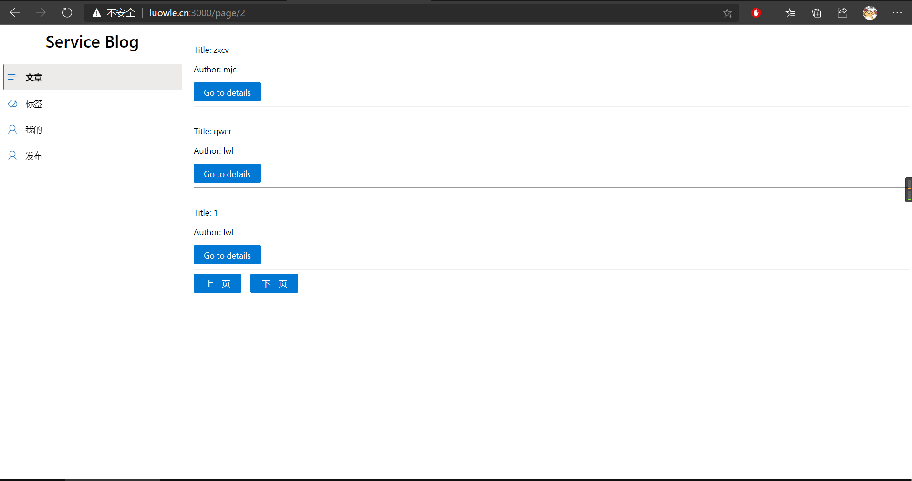

# 服务计算项目小结

| 课程名称 | 服务计算 |   任课老师   |       潘茂林       |
| :------: | :----------: | :----------: | :----------------: |
|   年级   |    2018级    | 专业（方向） |    软件工程专业    |
|   学号   |   18342069   |     姓名     |       罗炜乐       |
|   电话   | 18027303477  |    Email     | luowle@foxmail.com |
| 开始日期 |  2020.12.20  |   完成日期   |     2020.12.21     |


## 完成内容
### 内容
1. 广场（显示所有博客）页面的前端
2. 广场（显示所有博客）页面的后端

### 显示效果
#### 网页主页

#### 进行翻页

#### 到达页面尽头


## 部分重要的代码解释
### 前端
1. 当页面的 `id` 号发生变化时，重新向后端请求数据。当到达页面尽头时，弹窗警告并返回上一页面
```typescript
  React.useEffect(() => {
    fetch("/api/page/"+ id, {
      method: "GET",
      credentials: "include"
    })
      .then(res => {
        if (!res.ok) {
          throw "failed to fetch"
        } 
        return res.json();
      })
      .then(data => {
        if (data.status === "success") {
          console.log(data)
          setList(data.data);
        } else {
          alert("已到列表的尽头");
          window.history.back();
        }
      })
      .catch(err => {
        alert(err);
      });
  }, [id]);
```
2. 把 `json` 的 `list` 数据逐条展示出来
```typescript
<Stack>
    { 
        list.map((v, i) => {
            return <Stack.Item key={i} styles={{ root: { paddingTop: 10 } }}>
                <p>Title: {v.title}</p>
                <p>Author: {v.username}</p>
                <PrimaryButton>
                <NavLink style={{ textDecoration: "none", color: "white" }} to={`/details/${v.blog_id}`}>Go to details</NavLink>
                </PrimaryButton>
                <hr/>
            </Stack.Item>;
        })
    }
</Stack>
```
### 后端
1. 将数据库请求到的表转换为一个 `map slice`，并倒序显示（使最新的数据放在最上面）
```go
func getJSON(sqlString string) ([]map[string]interface{}, error) {
	rows, err := Db.Query(sqlString)
	if err != nil {
		return nil, err
	}
	defer rows.Close()
	columns, err := rows.Columns()
	if err != nil {
		return nil, err
	}
	count := len(columns)
	tableData := make([]map[string]interface{}, 0)
	values := make([]interface{}, count)
	valuePtrs := make([]interface{}, count)
	for rows.Next() {
		for i := 0; i < count; i++ {
			valuePtrs[i] = &values[i]
		}
		rows.Scan(valuePtrs...)
		entry := make(map[string]interface{})
		for i, col := range columns {
			var v interface{}
			val := values[i]
			b, ok := val.([]byte)
			if ok {
				v = string(b)
			} else {
				v = val
			}
			entry[col] = v
		}
		tableData = append(tableData, entry)
	}
	for i, j := 0, len(tableData)-1; i < j; i, j = i+1, j-1 {
		tableData[i], tableData[j] = tableData[j], tableData[i]
	}
	return tableData, nil
}
```
2. 对分页的处理让每页只显示三个数据，最后一页显示1-3个数据，并判断请求的页面是否有越界，越界了则返回 `"status"="fail"`
```go
r.GET("/page/:id", Page)

func Page(c *gin.Context) {
	id, covErr := strconv.Atoi(c.Param("id"))
	result, err := getJSON("select blog_id, username, title from blog, user where blog.author_id=user.user_id;")
	status := "undefined"
	itemPerPage := 3
	start := (id - 1) * itemPerPage
	last := id * itemPerPage
	if id*itemPerPage > len(result) {
		last = len(result)
	}

	if err != nil || covErr != nil || id < 1 || (id-1)*itemPerPage >= len(result) {
		status = "fail"
		start, last = 0, 0
	} else {
		status = "success"
	}

	c.JSON(http.StatusOK, gin.H{
		"status": status,
		"data":   result[start:last],
	})
}
```

## 心得
1. 了解了 `REST` 风格的 `API`
2. 学习了前端框架 `React` 和后端框架 `gin`
3. 了解并体验了前后端分离开发的优势
4. 感受到前后端思维模式的不同，学会了在数据库拿到数据后如何给前端使用。