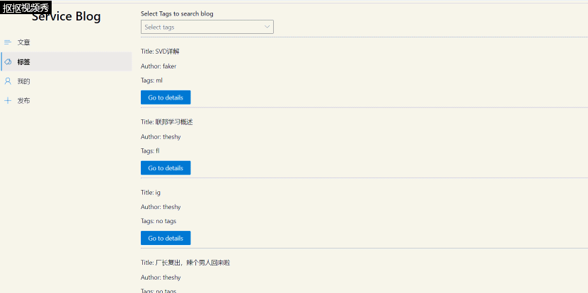

# 服务计算项目小结

| 课程名称 | 服务计算 |   任课老师   |       潘茂林       |
| :------: | :----------: | :----------: | :----------------: |
|   年级   |    2018级    | 专业（方向） |    软件工程专业    |
|   学号   |   18353070   |     姓名     |       谭嘉伟     |


## 完成内容
### 完成工作
+ 一、“发布”页面的**后端**，该页面功能为：  
   + 登录后可以发布博客
   + 发布博客时可以设置标题、添加tag，正文应该以markdown语法书写，以便详情渲染  

+ 三、"标签"页面的**后端**部分，该页面的功能为：  
   + 根据标签筛选文章
   + 同时选中多个标签将筛选出同时具有这些标签的文章  

### 显示效果
#### 1、“post”界面查看自身所有的文章：
我们首先发布以下文章：  
  
然后再去文章广场，可以发现有这篇文章：  
  
点进去之后详情页面如下：  
  
可以看到文章内容正确符合数据  
#### 3、“标签”页面根据tags筛选文章
我们利用一个dropdown多选框选择tags，显示同时包含选中的tags的文章：（动图）  
  

## 部分重要的代码解释
### "发布"页面的“后端”
1. 首先我们需要判断用户是否登录，如果未登录则不允许发布博客：
```go
func Post(c *gin.Context) {

	data, _ := ioutil.ReadAll(c.Request.Body)
	blogInfo := make(map[string]interface{})
	if err := json.Unmarshal(data, &blogInfo); err != nil {
		fmt.Println("error")
	}

    //解析json格式的post请求

	title := blogInfo["title"]
	author_id := blogInfo["author_id"]
	tags := blogInfo["tags"].([]interface{})
	text := blogInfo["text"]

	fmt.Println("title:", title)
	fmt.Println("author_id:", author_id)
	fmt.Print("tags:")

	for i := 0; i < len(tags); i++ {
		fmt.Print(" ", tags[i])
	}
	fmt.Println()
	fmt.Println("text:", text)

    //如果未登录则author_id为-1，借此判断

	if author_id.(float64) <= 0 {   
		fmt.Println("not login")
		c.JSON(http.StatusOK, gin.H{
			"status": "not login",
			"Data":   nil,
		})
		return
	}

```
2. 然后就是发布博客的主过程，主要是对数据库操作，详情请查看注释：
```go

//将文章的标题、作者id、正文内容存入数据库

result, err := Db.Exec("insert into blog (author_id, title, text) values (?,?,?);", author_id, title, text)
	var blog_id int64
	if err != nil {
		fmt.Println("err:%s", err)
		c.JSON(http.StatusOK, gin.H{
			"status": "failure",
			"Data":   nil,
		})
		return
	} else {
		blog_id, _ = result.LastInsertId()
	}

//处理tags

	for i := 0; i < len(tags); i++ {
		tag := tags[i]
		var tag_id int64
		err = Db.QueryRow("select tag_id from tag where tag_name = ?", tag).Scan(&tag_id)
		if err != nil {
			if err == sql.ErrNoRows { //如果未查询到对应字段,将新tag加入数据库中
				result, err = Db.Exec("insert into tag (tag_name) values (?);", tag)
				fmt.Println("tag not found, insert into databse")
				if err != nil {
					fmt.Println("err:%s", err)
					c.JSON(http.StatusOK, gin.H{
						"status": "failure",
						"Data":   nil,
					})
					return
				} else {
					tag_id, _ = result.LastInsertId()
				}
			} else {
				fmt.Println("failue")
				log.Fatal(err)
				c.JSON(http.StatusOK, gin.H{
					"status": "failure",
					"Data":   nil,
				})
				return
			}
		}

        //将tag加入tag_blog表建立blog和tag的关系

		result, err = Db.Exec("insert into tag_blog (tag_id, blog_id) values (?,?);", tag_id, blog_id)
		if err != nil {
			fmt.Println("err%s", err)
			c.JSON(http.StatusOK, gin.H{
				"status": "failure",
				"Data":   nil,
			})
			return
		}
	}

	c.JSON(http.StatusOK, gin.H{
		"status": "success",
		"Data": map[string]interface{}{
			"blog_id": blog_id,
		},
	})

}
```
### “标签”页面的前端：
#### 1. 前后端交互部分与数据结构。  
我们与前端做的约定如下：后端将所有的tags以及文章返回下来，由前端筛选。我们建立两个struct分别存储tag信息和博客信息
```go
type Tag struct {
	Id      int    `json:"id"`
	Tagname string `json:"tagname"`
}

type BlogT struct {
	ID     int      `json:"id"`
	Author string   `json:"author"`
	Title  string   `json:"title"`
	Tags   []string `json:"tags"`
}

```
#### 2. 筛选全部博客以及文章并返回。  
我们封装了两个函数去分别筛选取得所有的博客和所有的文章。其中获得每篇文章对应的tags运用了两层循环：  
```go

//该函数返回所有tag

func getTags() (tags []Tag, err error) {
	rows, err := Db.Query("SELECT tag_id,tag_name FROM tag")
	for rows.Next() {
		var tag1 Tag

		//遍历tag表中所有行的信息

		rows.Scan(&tag1.Id, &tag1.Tagname)

		//将tag信息添加到users中

		tags = append(tags, tag1)
	}
	return
}

//该函数返回所有blog的信息，博客的tag以切片形式返回

func getblogTs() (blogs []BlogT, err error) {

    //返回所有博客的id、标题、作者名

	rows, err := Db.Query("select blog_id,title,username from blog, user where user.user_id = blog.author_id ")
	for rows.Next() {   //遍历取到的每一篇博客
		var tag1 BlogT
		rows.Scan(&tag1.ID, &tag1.Title, &tag1.Author)

        //取出这一篇博客的所有tag

		rows2, _ := Db.Query("select tag_name from tag_blog, tag where tag.tag_id = tag_blog.tag_id and tag_blog.blog_id = ?", tag1.ID)
		for rows2.Next() {
			var tag string
			rows2.Scan(&tag)

            //加入到这篇博客的tags数组里

			tag1.Tags = append(tag1.Tags, tag)
		}
		blogs = append(blogs, tag1)
	}
	return
}

func Tags(c *gin.Context) {
	tags, err := getTags()
	blogs, _ := getblogTs()
	if err != nil {
		log.Fatal(err)
	}
	//H is a shortcut for map[string]interface{}
	c.JSON(http.StatusOK, gin.H{    //按格式返回所有的博客和tags
		"status": "success",
		"tags":   tags,
		"blogs":  blogs,
		"count":  len(tags),
	})
}
```

## 遇到的部分问题与解决方法
1. 在后端解析前端的请求时，一直无法得到正确的结果。解决：根据前端发送请求s的形式的不同。后端需要对应的采用c.Bind或者c.param。当前端请求同时包含json数据以及form或者cookie时难以直接使用bind。经过google找到了如今的解析方法。
2. 后端访问数据库时取到的sql.rows文件解析出错。解决：需要详细的考虑定义的结构体中的数据的类型和数据库返回类型的对应关系以及赋值的顺序。
3. 执行数据库的dbexce命令错误。解决：需要注意数据库的外键约束，需要谨慎插入数据，尤其需要谨慎删除。除此之外还需要巩固sql语句的写法。更好的做法是利用一些数据库框架比如xorm。
## 心得
1. 学习了后端框架 `gin`。将先前学到的go语言知识融会贯通，并且学会了利用go语言搭建服务器。
2. 学习并巩固了前后端的交互，了解了前后端分离工作的优越性以及隐蔽性。同时前后端交互还兼顾较高的效率，将数据利用后端的服务器与数据库处理远优于前端使用js处理数据。
3. 学习巩固了利用代码与数据库进行交互，学习了很多数据库结构与操作之间的关系。
4. 学习巩固了和同学合作，交流的能力。分工合作和相互沟通、相互配合是非常重要的能力。好的分工合作往往能事半功倍，反之亦然
