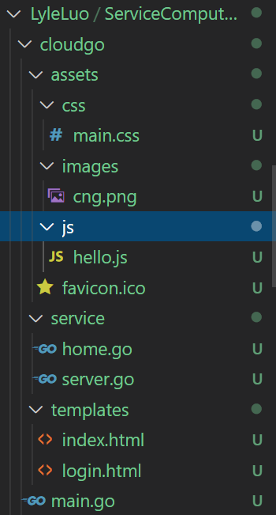
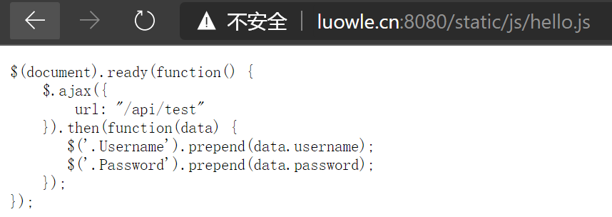
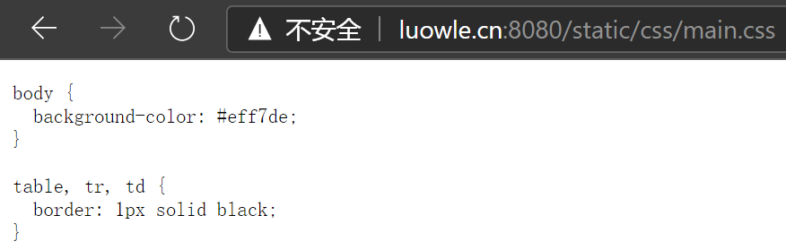
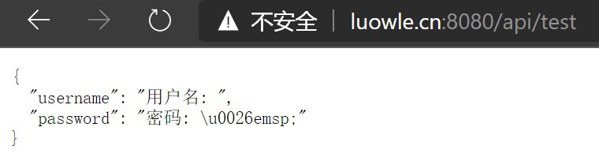
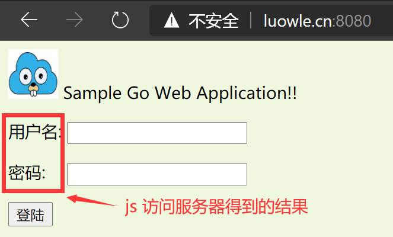
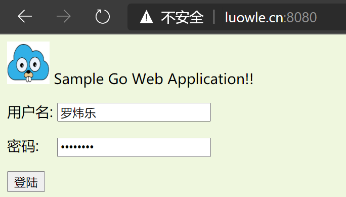
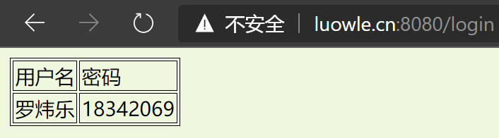

# 开发 web 服务程序——cloudgo

<!-- TOC -->

- [开发 web 服务程序——cloudgo](#开发-web-服务程序cloudgo)
  - [任务要求](#任务要求)
  - [cloudgo](#cloudgo)
    - [支持静态文件服务](#支持静态文件服务)
      - [代码](#代码)
      - [目录结构](#目录结构)
      - [效果](#效果)
    - [支持简单 js 访问](#支持简单-js-访问)
      - [代码](#代码-1)
      - [效果](#效果-1)
    - [提交表单输出表格](#提交表单输出表格)
      - [代码](#代码-2)
      - [效果](#效果-2)
  - [curl 测试](#curl-测试)
    - [在本地端进行](#在本地端进行)
    - [在服务器端进行](#在服务器端进行)
  - [ab 测试](#ab-测试)
    - [命令参数含义](#命令参数含义)
    - [结果参数含义](#结果参数含义)
    - [测试结果](#测试结果)
      - [100 并发，1000 总请求](#100-并发1000-总请求)
      - [500 并发，10000 总请求](#500-并发10000-总请求)
  - [扩展要求](#扩展要求)

<!-- /TOC -->

## 任务要求

1. 基本要求

- 编程 web 服务程序 类似 cloudgo 应用。
  - 支持静态文件服务
  - 支持简单 js 访问
  - 提交表单，并输出一个表格（必须使用模板）
- 使用 curl 测试，将测试结果写入 README.md
- 使用 ab 测试，将测试结果写入 README.md。并解释重要参数。

2. 扩展要求

选择以下一个或多个任务，以博客的形式提交。

- 通过源码分析、解释一些关键功能实现
- 选择简单的库，如 mux 等，通过源码分析、解释它是如何实现扩展的原理，包括一些 golang 程序设计技巧。


## cloudgo

### 支持静态文件服务

#### 代码

```go
mx.PathPrefix("/static").Handler(http.StripPrefix("/static/", http.FileServer(http.Dir(webRoot+"/assets/"))))
```

#### 目录结构



#### 效果

```sh
[luowle@VM_0_4_centos cloudgo]$ go run main.go 
[negroni] listening on :8080
```





### 支持简单 js 访问

#### 代码

```html
<html>
<head>
  <link rel="stylesheet" href="css/main.css"/>
  <script src="http://libs.baidu.com/jquery/2.1.4/jquery.min.js"></script>
  <script src="js/hello.js"></script>
</head>
<body>
  
  Sample Go Web Application!!
      <div>
        <form action="/login" method="post">
          <p class="Username"><input type="text" name="username"></p>
          <p class="Password"><input type="password" name="password"></p>
          <input type="submit" value="登陆">
      </form>
      </div>
</body>
</html>
```

```js
$(document).ready(function() {
    $.ajax({
        url: "/api/test"
    }).then(function(data) {
       $('.Username').prepend(data.username);
       $('.Password').prepend(data.password);
    });
});
```

html 和 js 代码如上所示，可见原本的 html 文件的两个输入框前是没有文字的。html 文件通过 js 脚本通过路由访问后端服务器来获得数据文本。数据文本是“用户名：”和“密码：”。

```go
// initRoutes
mx.HandleFunc("/api/test", apiTestHandler(formatter)).Methods("GET")

// apiTestHandler
func apiTestHandler(formatter *render.Render) http.HandlerFunc {
	return func(w http.ResponseWriter, req *http.Request) {
		formatter.JSON(w, http.StatusOK, struct {
			Username string `json:"username"`
			Password string `json:"password"`
		}{Username: "用户名: ", Password: "密码: &emsp;"})
	}
}
```

#### 效果






### 提交表单输出表格

#### 代码

```html
<html>
<head>
    <link rel="stylesheet" href="css/main.css" />
</head>
<body>
    <table>
        <tr>
            <td>用户名</td>
            <td>密码</td>
        </tr>
        <tr>
            <td>{{.Username}}</td>
            <td>{{.Password}}</td>
        </tr>
    </table>
</body>
</html>
```

将数据插入到表格中

```go
func checkform(w http.ResponseWriter, r *http.Request) {
	r.ParseForm()
	username, password := template.HTMLEscapeString(r.Form.Get("username")), template.HTMLEscapeString(r.Form.Get("password"))
	template.Must(template.New("login.html").ParseFiles("templates/login.html")).Execute(w, struct {
		Username string
		Password string
	}{Username: username, Password: password})
}
```


#### 效果






## curl 测试

### 在本地端进行

在 Windows 的 cmd 由于编码格式的原因中文会出现乱码，但在浏览器是正常的。

```
C:\Users\luowle>curl -v luowle.cn:8080
* Rebuilt URL to: luowle.cn:8080/
*   Trying 106.52.168.105...
* TCP_NODELAY set
* Connected to luowle.cn (106.52.168.105) port 8080 (#0)
> GET / HTTP/1.1
> Host: luowle.cn:8080
> User-Agent: curl/7.55.1
> Accept: */*
>
< HTTP/1.1 200 OK
< Content-Type: text/html; charset=UTF-8
< Date: Sun, 22 Nov 2020 13:12:53 GMT
< Content-Length: 579
<
<html>
<head>
  <link rel="stylesheet" href="css/main.css"/>
  <script src="http://libs.baidu.com/jquery/2.1.4/jquery.min.js"></script>
  <script src="js/hello.js"></script>
</head>
<body>
  
  Sample Go Web Application!!
      <div>
        <form action="/login" method="post">
          <p class="Username"><input type="text" name="username"></p>
          <p class="Password"><input type="password" name="password"></p>
          <input type="submit" value="鐧婚檰">
      </form>
      </div>
</body>
</html>* Connection #0 to host luowle.cn left intact
```

```
C:\Users\luowle>curl -v luowle.cn:8080/static/css/main.css
*   Trying 106.52.168.105...
* TCP_NODELAY set
* Connected to luowle.cn (106.52.168.105) port 8080 (#0)
> GET /static/css/main.css HTTP/1.1
> Host: luowle.cn:8080
> User-Agent: curl/7.55.1
> Accept: */*
>
< HTTP/1.1 200 OK
< Accept-Ranges: bytes
< Content-Length: 89
< Content-Type: text/css; charset=utf-8
< Last-Modified: Sun, 22 Nov 2020 07:16:36 GMT
< Date: Sun, 22 Nov 2020 13:16:53 GMT
<
body {
  background-color: #eff7de;
}

table, tr, td {
  border: 1px solid black;
}* Connection #0 to host luowle.cn left intact
```

### 在服务器端进行

```
[luowle@VM_0_4_centos ~]$ curl -v luowle.cn:8080/api/test
* About to connect() to luowle.cn port 8080 (#0)
*   Trying 106.52.168.105...
* Connected to luowle.cn (106.52.168.105) port 8080 (#0)
> GET /api/test HTTP/1.1
> User-Agent: curl/7.29.0
> Host: luowle.cn:8080
> Accept: */*
> 
< HTTP/1.1 200 OK
< Content-Type: application/json; charset=UTF-8
< Date: Sun, 22 Nov 2020 13:19:45 GMT
< Content-Length: 69
< 
{
  "username": "用户名: ",
  "password": "密码: \u0026emsp;"
}
* Connection #0 to host luowle.cn left intact
```

```
[luowle@VM_0_4_centos ~]$ curl -v luowle.cn:8080/static/js/hello.js
* About to connect() to luowle.cn port 8080 (#0)
*   Trying 106.52.168.105...
* Connected to luowle.cn (106.52.168.105) port 8080 (#0)
> GET /static/js/hello.js HTTP/1.1
> User-Agent: curl/7.29.0
> Host: luowle.cn:8080
> Accept: */*
> 
< HTTP/1.1 200 OK
< Accept-Ranges: bytes
< Content-Length: 210
< Content-Type: application/javascript
< Last-Modified: Sun, 22 Nov 2020 09:32:35 GMT
< Date: Sun, 22 Nov 2020 13:21:22 GMT
< 
$(document).ready(function() {
    $.ajax({
        url: "/api/test"
    }).then(function(data) {
       $('.Username').prepend(data.username);
       $('.Password').prepend(data.password);
    });
});
* Connection #0 to host luowle.cn left intact
```

## ab 测试

### 命令参数含义

输入参数：

| 参数 |                             含义                             |
| :--: | :----------------------------------------------------------: |
|  -n  |        测试会话中所执行的请求个数,默认仅执行一个请求         |
|  -c  |  一次产生的请求个数,即同一时间发出多少个请求,默认为一次一个  |
|  -t  | 测试所进行的最大秒数,默认为无时间限制....其内部隐含值是[-n 50000],它可以使对服务器的测试限制在一个固定的总时间以内 |
|  -p  |                  包含了需要POST的数据的文件                  |
|  -T  |              POST数据所使用的Content-type头信息              |
|  -v  |                    设置显示信息的详细程度                    |
|  -w  | 以HTML表格的形式输出结果,默认是白色背景的两列宽度的一张表|
|-i |以HTML表格的形式输出结果,默认是白色背景的两列宽度的一张表|
|-x |设置< table >属性的字符串,此属性被填入< table 这里> |
|-y | 设置< tr >属性的字符串|
|-z |设置< td >属性的字符串|
|-C | 对请求附加一个Cookie行，其典型形式是name=value的参数对,此参数可以重复|
|-H |对请求附加额外的头信息,此参数的典型形式是一个有效的头信息行,其中包含了以冒号分隔的字段和值的对(如"Accept-Encoding: zip/zop;8bit")|
|-A |HTTP验证,用冒号:分隔传递用户名及密码|
|-P |无论服务器是否需要(即是否发送了401认证需求代码),此字符串都会被发送|
|-X |对请求使用代理服务器|
|-V |显示版本号并退出|
|-k |启用HTTP KeepAlive功能,即在一个HTTP会话中执行多个请求,默认为不启用KeepAlive功能|
|-d |不显示"percentage served within XX [ms] table"的消息(为以前的版本提供支持)|
|-S |不显示中值和标准背离值,且均值和中值为标准背离值的1到2倍时,也不显示警告或出错信息,默认会显示最小值/均值/最大值等(为以前的版本提供支持)|
|-g |把所有测试结果写入一个'gnuplot'或者TSV(以Tab分隔的)文件|
|-e |产生一个以逗号分隔的(CSV)文件,其中包含了处理每个相应百分比的请求所需要(从1%到100%)的相应百分比的(以微妙为单位)时间|
|-h| 显示使用方法|
|-k |发送keep-alive指令到服务器端|

### 结果参数含义

结果参数：

|                             参数                             |              含义              |
| :----------------------------------------------------------: | :----------------------------: |
|                       Server Software                        |              平台              |
|                       Server Hostname                        |           服务器域名           |
|                         Server Port                          |           服务器端口           |
|                        Document Path                         |         测试的页面文档         |
|                       Document Length                        |            文档大小            |
|                      Concurrency Level                       |   此次测试的一轮请求的并发数   |
|                     Time taken for tests                     |           测试的时长           |
|                       Complete request                       |        完成的请求测试数        |
|                       Failed requests                        |         失败的请求数量         |
|                      Total transferred                       |     整个场景中的网络传输量     |
|                       HTML transferred                       |   整个场景中的HTML内容传输量   |
|                      Request per second                      |        每秒完成的请求数        |
|                       Time per request                       |       每次请求所用的时间       |
|                        Transfer rate                         |      平均每秒网络上的流量      |
|                       Connection Times                       |        各阶段所需的时间        |
| Percentage of the requests served within a certain time (ms) | 整个场景中所有请求的响应情况。 |

### 测试结果

#### 100 并发，1000 总请求

对主页使用 ab 测试

```
C:\Users\luowle\Desktop\Apache24\bin>ab -n 1000 -c 100 http://luowle.cn:8080/
This is ApacheBench, Version 2.3 <$Revision: 1879490 $>
Copyright 1996 Adam Twiss, Zeus Technology Ltd, http://www.zeustech.net/
Licensed to The Apache Software Foundation, http://www.apache.org/

Benchmarking luowle.cn (be patient)
Completed 100 requests
Completed 200 requests
Completed 300 requests
Completed 400 requests
Completed 500 requests
Completed 600 requests
Completed 700 requests
Completed 800 requests
Completed 900 requests
Completed 1000 requests
Finished 1000 requests


Server Software:
Server Hostname:        luowle.cn
Server Port:            8080

Document Path:          /
Document Length:        579 bytes

Concurrency Level:      100
Time taken for tests:   17.119 seconds
Complete requests:      1000
Failed requests:        0
Total transferred:      696000 bytes
HTML transferred:       579000 bytes
Requests per second:    58.41 [#/sec] (mean)
Time per request:       1711.896 [ms] (mean)
Time per request:       17.119 [ms] (mean, across all concurrent requests)
Transfer rate:          39.70 [Kbytes/sec] received

Connection Times (ms)
              min  mean[+/-sd] median   max
Connect:        6   17  14.4     11      89
Processing:    26 1624 495.9   1631    2787
Waiting:       12  858 553.5    815    2492
Total:         34 1641 498.5   1649    2831

Percentage of the requests served within a certain time (ms)
  50%   1649
  66%   1842
  75%   1896
  80%   1952
  90%   2261
  95%   2612
  98%   2749
  99%   2761
 100%   2831 (longest request)
```

#### 500 并发，10000 总请求

对 js 文件使用 ab 测试

```
C:\Users\luowle\Desktop\Apache24\bin>ab -n 10000 -c 200 http://luowle.cn:8080/static/js/hello.js
This is ApacheBench, Version 2.3 <$Revision: 1879490 $>
Copyright 1996 Adam Twiss, Zeus Technology Ltd, http://www.zeustech.net/
Licensed to The Apache Software Foundation, http://www.apache.org/

Benchmarking luowle.cn (be patient)
Completed 1000 requests
Completed 2000 requests
Completed 3000 requests
Completed 4000 requests
Completed 5000 requests
Completed 6000 requests
Completed 7000 requests
Completed 8000 requests
Completed 9000 requests
Completed 10000 requests
Finished 10000 requests


Server Software:
Server Hostname:        luowle.cn
Server Port:            8080

Document Path:          /static/js/hello.js
Document Length:        210 bytes

Concurrency Level:      200
Time taken for tests:   450.160 seconds
Complete requests:      10000
Failed requests:        8
   (Connect: 8, Receive: 0, Length: 0, Exceptions: 0)
Total transferred:      3930000 bytes
HTML transferred:       2100000 bytes
Requests per second:    22.21 [#/sec] (mean)
Time per request:       9003.202 [ms] (mean)
Time per request:       45.016 [ms] (mean, across all concurrent requests)
Transfer rate:          8.53 [Kbytes/sec] received

Connection Times (ms)
              min  mean[+/-sd] median   max
Connect:        5   28  99.8     12    3010
Processing:    17 8933 9351.6   5878   51322
Waiting:       10 4745 7030.3   2698   48032
Total:         25 8961 9353.1   5905   51373

Percentage of the requests served within a certain time (ms)
  50%   5905
  66%   7543
  75%   8635
  80%   9886
  90%  24203
  95%  25958
  98%  46838
  99%  48064
 100%  51373 (longest request)
```

可以看到，在并发数和访问数量都增大的时候，Time per request 显著增大了。

## 扩展要求

[net/http库源码分析](https://blog.csdn.net/weixin_43177335/article/details/109999043)