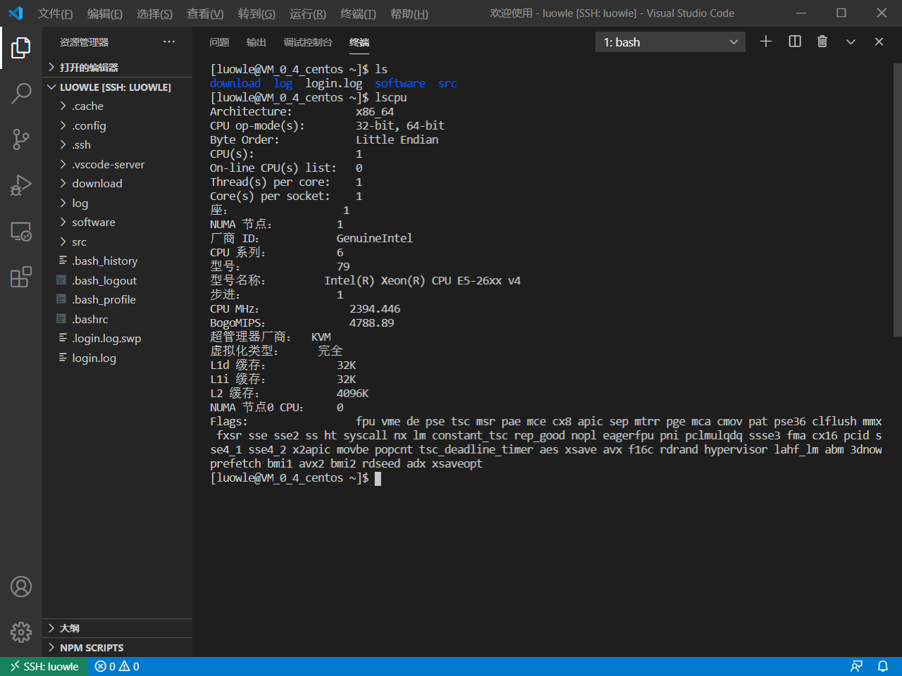

# 作业一
如果图片无法加载，请 __科学上网__ ！！！
## 系统硬件与操作系统
由于虚拟机和云服务器都可以胜任本课程的任务，感觉使用云服务器更贴近本课程的内容，加上我本来就有一个云服务器，因此我选择了使用云服务器。
+ 服务器来源：腾讯云服务器（学生机）
+ Intel(R) Xeon(R) CPU E5-26xx v4
+ Memory 2GB
+ Disk 50G
+ CentOS Linux release 7.6.1810 (Core)


## 安装过程
### 首先配置舒服的终端环境（Visual Studio Code）
原本我是使用[Xshell](https://www.netsarang.com/zh/xshell/)+[Xftp](https://www.netsarang.com/zh/xftp/)。这套组合管理多个服务器十分方便，个人十分安利这套组合。但考虑到本课程会涉及到大量的编码，使用VS Code无论是在编程上还是远程调试上都方便许多，于是选择使用VS Code作为以后实验的主要工具。基本人人都在Windows上安装过VS Code，因此不再赘述安装过程。

1. 安装Remote SSH插件  

2. 新增配置文件  
  
配置文件内容如下所示，由于懒得输密码，我使用了密钥登陆（[生成密钥教程](https://www.cnblogs.com/henkeyi/p/10487553.html)）。其中IdentityFile是本地私钥的路径，公钥放到云服务器的 ~/.ssh/authorized_keys 上。
```
Host luowle  
    HostName luowle.cn  
    User luowle  
    IdentityFile "C:\Users\31290\.ssh\luowle_id_rsa"
```
3. 容易进行开发的终端环境就这样建立好了


### golang配置
#### 安装
1. 使用yum进行安装
```
yum install golang
```

2. 查看安装目录，可见安装在 /usr/lib/golang 上
```
[root@VM_0_4_centos luowle]# rpm -ql golang |more
/etc/gdbinit.d
/etc/gdbinit.d/golang.gdb
/etc/prelink.conf.d
/etc/prelink.conf.d/golang.conf
/usr/lib/golang
/usr/lib/golang/VERSION
/usr/lib/golang/api
/usr/lib/golang/api/README
/usr/lib/golang/api/except.txt
……
……
```  

3. 查看版本
```
[root@VM_0_4_centos luowle]# go version
go version go1.13.14 linux/amd64
```  

#### 设置环境变量
1. 从root切换回平常使用的账户（luowle），创建工作目录
```sh
[luowle@VM_0_4_centos ~]$ mkdir $HOME/gowork
[luowle@VM_0_4_centos ~]$ ls
download  gowork  log  login.log  software  src
```
2. 配置环境变量，对于 centos 在 ~/.bashrc 文件中添加以下环境变量后重新载入
```sh
export GOPATH=$HOME/gowork
export PATH=$PATH:$GOPATH/bin
source $HOME/.bashrc
```
3. 检查配置
```
[luowle@VM_0_4_centos ~]$ go env
GO111MODULE=""
GOARCH="amd64"
GOBIN=""
GOCACHE="/home/luowle/.cache/go-build"
GOENV="/home/luowle/.config/go/env"
GOEXE=""
GOFLAGS=""
GOHOSTARCH="amd64"
GOHOSTOS="linux"
GONOPROXY=""
GONOSUMDB=""
GOOS="linux"
GOPATH="/home/luowle/go"
GOPRIVATE=""
GOPROXY="direct"
GOROOT="/usr/lib/golang"
GOSUMDB="off"
GOTMPDIR=""
GOTOOLDIR="/usr/lib/golang/pkg/tool/linux_amd64"
GCCGO="gccgo"
AR="ar"
CC="gcc"
CXX="g++"
CGO_ENABLED="1"
GOMOD=""
CGO_CFLAGS="-g -O2"
CGO_CPPFLAGS=""
CGO_CXXFLAGS="-g -O2"
CGO_FFLAGS="-g -O2"
CGO_LDFLAGS="-g -O2"
PKG_CONFIG="pkg-config"
GOGCCFLAGS="-fPIC -m64 -pthread -fmessage-length=0 -fdebug-prefix-map=/tmp/go-build080279731=/tmp/go-build -gno-record-gcc-switches"
```

#### 创建Hello, world!
1. 重新登陆后创建源代码目录
```sh
$ mkdir $GOPATH/src/github.com/github-user/hello -p
```

2. 使用 VS Code 创建 hello.go   
```go  
package main
import "fmt"
func main() {
    fmt.Printf("hello, world\n")
}
``` 

3. 在终端运行  
```sh  
[luowle@VM_0_4_centos hello]$ go run hello.go 
hello, world
```

### 安装必要的工具和插件
#### GIT
git在yum安装的时候已经自动安装了依赖，无需再安装

#### 安装 go 的一些工具  
进入 VS Code 就提示需要安装相关工具，如下图所示。  
  
但是点击install后会出现失败，错误与下面的类似
```
gocode:
Error: Command failed: /usr/local/go/bin/go get -u -v github.com/mdempsky/gocode
github.com/mdempsky/gocode (download)
Fetching https://golang.org/x/tools/go/gcexportdata?go-get=1
https fetch failed: Get https://golang.org/x/tools/go/gcexportdata?go-get=1: dial tcp 216.239.37.1:443: i/o timeout
package golang.org/x/tools/go/gcexportdata: unrecognized import path "golang.org/x/tools/go/gcexportdata" (https fetch: Get https://golang.org/x/tools/go/gcexportdata?go-get=1: dial tcp 216.239.37.1:443: i/o timeout)
```
由于众所周知的原因安装不成功。因此需要手动安装！

1. 下载源代码到本地
```sh
# 创建文件夹
mkdir $GOPATH/src/golang.org/x/ -p
# 下载源码
go get -d github.com/golang/tools
# copy 
cp $GOPATH/src/github.com/golang/tools $GOPATH/src/golang.org/x/ -rf
```

2. 安装工具包
```
$ go install golang.org/x/tools/go/buildutil
```

VS Code 需要非常多的工具，于是直接使用上面类似的方法批量下载  

```
cd $GOPATH/src/golang.org/x/
git clone https://github.com/golang/tools.git
git clone https://github.com/golang/lint.git
git clone https://github.com/golang/tools.git tools
git clone https://github.com/golang/lint.git lint
git clone https://github.com/golang/mod.git mod
git clone https://github.com/golang/xerrors.git xerrors
git clone https://github.com/golang/net.git net

go get -v github.com/ramya-rao-a/go-outline
go get -v github.com/acroca/go-symbols
go get -v github.com/mdempsky/gocode
go get -v github.com/rogpeppe/godef
go get -v github.com/zmb3/gogetdoc
go get -v github.com/fatih/gomodifytags
go get -v sourcegraph.com/sqs/goreturns
go get -v github.com/cweill/gotests/...
go get -v github.com/josharian/impl
go get -v github.com/haya14busa/goplay/cmd/goplay
go get -v github.com/uudashr/gopkgs/cmd/gopkgs
go get -v github.com/davidrjenni/reftools/cmd/fillstruct
go get -v github.com/alecthomas/gometalinter

go install github.com/ramya-rao-a/go-outline
go install github.com/acroca/go-symbols
go install github.com/mdempsky/gocode
go install github.com/rogpeppe/godef
go install github.com/zmb3/gogetdoc
go install github.com/fatih/gomodifytags
go install sourcegraph.com/sqs/goreturns
go install github.com/cweill/gotests/...
go install github.com/josharian/impl
go install github.com/haya14busa/goplay/cmd/goplay
go install github.com/uudashr/gopkgs/cmd/gopkgs
go install github.com/davidrjenni/reftools/cmd/fillstruct
go install github.com/alecthomas/gometalinter
$GOPATH/bin/gometalinter --install
go install golang.org/x/tools/cmd/godoc
go install golang.org/x/lint/golint
go install golang.org/x/tools/cmd/gorename
go install golang.org/x/tools/cmd/goimports
go install golang.org/x/tools/cmd/guru
```
然后基本都能成功安装，但是还提示缺少 gocode-gomod，解决方法如下
-  Enable the go modules feature 开启代理模式
```sh
export GO111MODULE=on
```
- Set the GOPROXY environment variable 设置代理地址
```sh
export GOPROXY=https://goproxy.io
```
- 先在终端执行
```sh
go get -u github.com/stamblerre/gocode
```
- 然后进入 bin 目录重命名 gocode 文件为 gocode-gomod

- 再在终端执行
```sh
go get -u github.com/mdempsky/gocode
```
- 重启 VS Code

其实设置[__代理__](https://goproxy.io)后一般都可以直接下载
```
go env -w GO111MODULE=on
go env -w GOPROXY=https://goproxy.io,direct

# 设置不走 proxy 的私有仓库，多个用逗号相隔（可选）
go env -w GOPRIVATE=*.corp.example.com

# 设置不走 proxy 的私有组织（可选）
go env -w GOPRIVATE=example.com/org_name
```
3. 安装运行Hello, world!  
在乱配一通环境后，发现安装不上hello，同时也跑不起来。
```
[luowle@VM_0_4_centos ~]$ go install github.com/github-user/hello
can't load package: package github.com/github-user/hello: git ls-remote -q https://github.com/github-user/hello in /home/luowle/go/pkg/mod/cache/vcs/1a11ea36e4cea7b1bc228ad91962f1410a58043ef13ab54c400a76e40cdd372b: exit status 128:
        remote: Repository not found.
        fatal: repository 'https://github.com/github-user/hello/' not found
[luowle@VM_0_4_centos ~]$ go install github.com/github-user/hello
can't load package: package github.com/github-user/hello: git ls-remote -q https://github.com/github-user/hello in /home/luowle/go/pkg/mod/cache/vcs/1a11ea36e4cea7b1bc228ad91962f1410a58043ef13ab54c400a76e40cdd372b: exit status 128:
        remote: Repository not found.
        fatal: repository 'https://github.com/github-user/hello/' not found
[luowle@VM_0_4_centos src]$ go run github.com/github-user/hello
go: cannot find main module; see 'go help modules'
```
百度之后发现要重新设置环境变量，这个环境变量在上面设置代理的时候修改过，要安装则重新设置环境变量GO111MODULE
```sh
[luowle@VM_0_4_centos ~]$ export GO111MODULE=auto
[luowle@VM_0_4_centos ~]$ go install github.com/github-user/hello
[luowle@VM_0_4_centos ~]$ hello
hello, world
```

#### 安装与运行 go tour
```sh
[luowle@VM_0_4_centos ~]$ go get github.com/Go-zh/tour/gotour
[luowle@VM_0_4_centos ~]$ gotour
github.com/Go-zh/tour/gotour has moved to golang.org/x/tour
```

### 添加远程调试环境
1. 在服务器端使用如下指令安装dlv
```
go get -v github.com/go-delve/delve/cmd/dlv
```
2. 在本地安装dlv
在Visual Code的菜单栏上，通过View(查看)->Command Palette(命令面板)打开Visual Code的命令界面，输入>Go:install/update Tools后回车，就能看到选择安装哪个go工具的菜单。选中dlv后，点击OK按钮，就会自动安装了。安装过程以及提示信息可以在OUTPUT窗口查看。

3. 编写 launch.json 文件
```json
{
    "version": "0.2.0",
    "configurations": [
        {
            "name": "Launch remote",
            "type": "go",
            "request": "launch",
            "mode": "remote",
            "program": "${fileDirname}",
            "remotePath": "/home/luowle/go/src/github.com/github-user/hello",
            //remotePath是文件所在路径
            "port": 2345,
            "host": "luowle.cn",
            "env": {},
            "args":  []
        }
    ]
}
```
4. 在服务器开启监听服务
```
[luowle@VM_0_4_centos hello]$ dlv debug hello.go --headless --listen ":2345" --log --api-version 2
API server listening at: [::]:2345
2020-09-10T21:17:53+08:00 info layer=debugger launching process with args: [/home/luowle/go/src/github.com/github-user/hello/__debug_bin]
```
如图所示，现在已经可以使用VS Code来远程调试golang了，各个功能都可以正常使用！


### 我的第一个包与测试
#### 自己使用牛顿法写一个Sqrt函数
包的代码如下所示

``` go
// Package hw1 随便写的一个库
package hw1

// Sqrt 自己写的牛顿法开根号
func Sqrt(x float64) float64 {
	z := 1.0
	for diff := 100.0; diff > 0.0001; {
		oldZ := z
		z -= (z*z - x) / (2 * x)
		if oldZ < z {
			diff = z - oldZ
		} else {
			diff = oldZ - z
		}
	}
	return z
}

```

修改hello，使其调用上面所写的包

``` go
package main

import (
	"fmt"

	"github.com/ServiceComputing/hw1"
)

func main() {
	fmt.Printf("hello, world\n")
	fmt.Printf("Sqrt(2) is %f\n", hw1.Sqrt(2))
}
```

运行结果如下所示
``` sh
[luowle@VM_0_4_centos hello]$ hello
hello, world
Sqrt(2) is 1.414177
```

#### 编写自己的测试
思路是将自己写的Sqrt与标准库math.Sqrt进行比较，如果两者相差超过0.01，则认为不通过测试  
测试代码如下所示  

``` go
package hw1

import (
	"math"
	"testing"
)

func TestReverse(t *testing.T) {
	cases := []float64{2, 3, 5, 7, 9, 16, 256, 1024, 4096}
	for _, c := range cases {
		result := Sqrt(c)
		if result-math.Sqrt(c) > 0.01 || math.Sqrt(c)-result > 0.01 {
			t.Errorf("my Sqrt(%f) == %f, but want %f", c, result, math.Sqrt(c))
		}
	}
}

```

测试结果如下所示，可见通过了自己的测试  

``` sh
[luowle@VM_0_4_centos hw1]$ go test
PASS
ok      github.com/ServiceComputing/hw1 0.002s
```

## 问题或要点小结
- SSH使用密钥登陆既可以提高安全性也可以免去自己敲代码的麻烦
- 由于网络原因不能上golang官网，很多东西无法下载。解决方法有二：
    1. 在GitHub上下载源码后安装（虽然也很慢）
    2. 使用[__代理__](https://goproxy.io)
- 要注意使用代理时的环境变量，没有用代理的需要时可以把GO111MODULE为auto
- 使用远程go调试时，配置文件搭配应为"request": "launch","mode": "remote"


## 参考资料
[VSCode安装GO语言依赖工具](https://www.jianshu.com/p/f952042af8ff)   
[利用delve（dlv）在Visual Code中进行go程序的远程调试-debug方式](https://www.jianshu.com/p/648cf61a9498)  
[go:cannot find main module;see 'go help modules'报错无法运行](https://blog.csdn.net/mr_oldcold/article/details/100759488?utm_medium=distribute.pc_relevant.none-task-blog-BlogCommendFromMachineLearnPai2-2.channel_param&depth_1-utm_source=distribute.pc_relevant.none-task-blog-BlogCommendFromMachineLearnPai2-2.channel_param)

