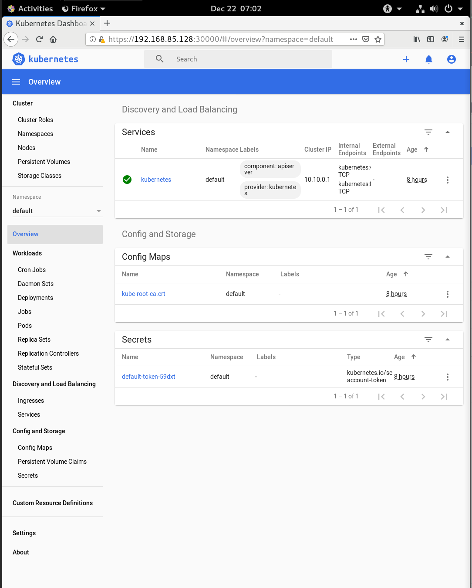

# 在Centos8上部署kubernetes1.20

## 系统准备

查看系统版本

```sh
[luowle@luowle ~]$ cat /etc/centos-release
CentOS Linux release 8.2.2004 (Core) 
```

配置网络

```sh
[luowle@luowle ~]$ cat /etc/sysconfig/network-scripts/ifcfg-ens32 
TYPE=Ethernet
PROXY_METHOD=none
BROWSER_ONLY=no
BOOTPROTO=dhcp
DEFROUTE=yes
IPV4_FAILURE_FATAL=no
IPV6INIT=yes
IPV6_AUTOCONF=yes
IPV6_DEFROUTE=yes
IPV6_FAILURE_FATAL=no
IPV6_ADDR_GEN_MODE=stable-privacy
NAME=ens32
UUID=c5f1dc3a-9375-432e-9a2a-77e5fcc85c4f
DEVICE=ens32
ONBOOT=no
```

添加阿里源

```sh
[root@luowle luowle]#  rm -rfv /etc/yum.repos.d/*
removed '/etc/yum.repos.d/CentOS-AppStream.repo'
removed '/etc/yum.repos.d/CentOS-Base.repo'
removed '/etc/yum.repos.d/CentOS-Base.repo.backup'
removed '/etc/yum.repos.d/CentOS-centosplus.repo'
removed '/etc/yum.repos.d/CentOS-CR.repo'
removed '/etc/yum.repos.d/CentOS-Debuginfo.repo'
removed '/etc/yum.repos.d/CentOS-Devel.repo'
removed '/etc/yum.repos.d/CentOS-Extras.repo'
removed '/etc/yum.repos.d/CentOS-fasttrack.repo'
removed '/etc/yum.repos.d/CentOS-HA.repo'
removed '/etc/yum.repos.d/CentOS-Media.repo'
removed '/etc/yum.repos.d/CentOS-PowerTools.repo'
removed '/etc/yum.repos.d/CentOS-Sources.repo'
removed '/etc/yum.repos.d/CentOS-Vault.repo'
removed '/etc/yum.repos.d/epel-modular.repo'
removed '/etc/yum.repos.d/epel-playground.repo'
removed '/etc/yum.repos.d/epel.repo'
removed '/etc/yum.repos.d/epel-testing-modular.repo'
removed '/etc/yum.repos.d/epel-testing.repo'
[root@luowle luowle]# curl -o /etc/yum.repos.d/CentOS-Base.repo http://mirrors.aliyun.com/repo/Centos-8.repo
  % Total    % Received % Xferd  Average Speed   Time    Time     Time  Current
                                 Dload  Upload   Total   Spent    Left  Speed
100  2595  100  2595    0     0  20595      0 --:--:-- --:--:-- --:--:-- 20595
```

配置主机名

```sh
[root@luowle ~]# cat /etc/hosts
127.0.0.1   localhost localhost.localdomain localhost4 localhost4.localdomain4
::1         localhost localhost.localdomain localhost6 localhost6.localdomain6
192.168.85.128 luowle.paas.com luowle


151.101.108.133 raw.githubusercontent.com

```

关闭swap，注释swap分区

```sh
[root@luowle luowle]# swapoff -a
[root@luowle luowle]# vi  /etc/fstab
[root@luowle luowle]# cat /etc/fstab 

#
# /etc/fstab
# Created by anaconda on Sun Oct 11 07:07:31 2020
#
# Accessible filesystems, by reference, are maintained under '/dev/disk/'.
# See man pages fstab(5), findfs(8), mount(8) and/or blkid(8) for more info.
#
# After editing this file, run 'systemctl daemon-reload' to update systemd
# units generated from this file.
#
/dev/mapper/cl-root     /                       xfs     defaults        0 0
UUID=0a448ac0-c666-46f9-8a7a-2d127ebf7d49 /boot                   ext4    defaults        1 2
#/dev/mapper/cl-swap     swap                    swap    defaults        0 0
```

配置内核参数，将桥接的IPv4流量传递到iptables的链

```sh
[root@luowle luowle]# cat > /etc/sysctl.d/k8s.conf <<EOF
> net.bridge.bridge-nf-call-ip6tables = 1
> net.bridge.bridge-nf-call-iptables = 1
> EOF
[root@luowle luowle]# sysctl --system
* Applying /usr/lib/sysctl.d/10-default-yama-scope.conf ...
kernel.yama.ptrace_scope = 0
* Applying /usr/lib/sysctl.d/50-coredump.conf ...
kernel.core_pattern = |/usr/lib/systemd/systemd-coredump %P %u %g %s %t %c %h %e
* Applying /usr/lib/sysctl.d/50-default.conf ...
kernel.sysrq = 16
kernel.core_uses_pid = 1
kernel.kptr_restrict = 1
net.ipv4.conf.all.rp_filter = 1
net.ipv4.conf.all.accept_source_route = 0
net.ipv4.conf.all.promote_secondaries = 1
net.core.default_qdisc = fq_codel
fs.protected_hardlinks = 1
fs.protected_symlinks = 1
* Applying /usr/lib/sysctl.d/50-libkcapi-optmem_max.conf ...
net.core.optmem_max = 81920
* Applying /usr/lib/sysctl.d/50-pid-max.conf ...
kernel.pid_max = 4194304
* Applying /usr/lib/sysctl.d/60-libvirtd.conf ...
fs.aio-max-nr = 1048576
* Applying /etc/sysctl.d/99-sysctl.conf ...
* Applying /etc/sysctl.d/k8s.conf ...
* Applying /etc/sysctl.conf ...
```

## 安装常用包

```sh
[root@luowle luowle]# yum install vim bash-completion net-tools gcc -y
```

## 使用aliyun源安装docker-ce

```
[root@luowle luowle]# yum install -y yum-utils device-mapper-persistent-data lvm2
[root@luowle luowle]# yum-config-manager --add-repo https://mirrors.aliyun.com/docker-ce/linux/centos/docker-ce.repo
[root@luowle luowle]# yum -y install docker-ce
```

报错

```sh
[root@luowle luowle]# yum -y install docker-ce
Docker CE Stable - x86_64                                                                                                                            58 kB/s |  28 kB     00:00    
Error: 
 Problem: package docker-ce-3:20.10.1-3.el7.x86_64 requires containerd.io >= 1.4.1, but none of the providers can be installed
  - cannot install the best candidate for the job
  - package containerd.io-1.4.3-3.1.el7.x86_64 is filtered out by modular filtering
(try to add '--skip-broken' to skip uninstallable packages or '--nobest' to use not only best candidate packages)

```

解决方法，安装以下包再`yum -y install docker-ce`安装`docker-ce`

```sh
[root@luowle ~]# yum install https://download.docker.com/linux/centos/8/x86_64/stable/Packages/containerd.io-1.4.3-3.1.el8.x86_64.rpm
```

添加`aliyundocker`加速器

```sh
[root@luowle ~]# mkdir -p /etc/docker
[root@luowle ~]# tee /etc/docker/daemon.json <<-'EOF'
> {
>   "registry-mirrors": ["https://fl791z1h.mirror.aliyuncs.com"]
> }
> EOF
[root@luowle ~]# systemctl daemon-reload
[root@luowle ~]# systemctl restart docker
[root@luowle ~]# systemctl enable docker.service

```

## 安装kubectl、kubelet、kubeadm

添加阿里kubernetes源

```sh
[root@luowle ~]# cat <<EOF > /etc/yum.repos.d/kubernetes.repo
> [kubernetes]
> name=Kubernetes
> baseurl=https://mirrors.aliyun.com/kubernetes/yum/repos/kubernetes-el7-x86_64/
> enabled=1
> gpgcheck=1
> repo_gpgcheck=1
> gpgkey=https://mirrors.aliyun.com/kubernetes/yum/doc/yum-key.gpg https://mirrors.aliyun.com/kubernetes/yum/doc/rpm-package-key.gpg
> EOF

```

安装

```sh
[root@luowle ~]# yum install kubectl kubelet kubeadm
[root@luowle ~]# systemctl enable kubelet
Created symlink /etc/systemd/system/multi-user.target.wants/kubelet.service → /usr/lib/systemd/system/kubelet.service.
```

## 初始化k8s集群

```sh
[root@luowle ~]# kubeadm init --kubernetes-version=1.20.1  --apiserver-advertise-address=192.168.85.128 --image-repository registry.aliyuncs.com/google_containers  --service-cidr=10.10.0.0/16 --pod-network-cidr=10.122.0.0/16
[init] Using Kubernetes version: v1.20.1
[preflight] Running pre-flight checks
	[WARNING Firewalld]: firewalld is active, please ensure ports [6443 10250] are open or your cluster may not function correctly
	[WARNING IsDockerSystemdCheck]: detected "cgroupfs" as the Docker cgroup driver. The recommended driver is "systemd". Please follow the guide at https://kubernetes.io/docs/setup/cri/
	[WARNING SystemVerification]: this Docker version is not on the list of validated versions: 20.10.1. Latest validated version: 19.03
[preflight] Pulling images required for setting up a Kubernetes cluster
[preflight] This might take a minute or two, depending on the speed of your internet connection
[preflight] You can also perform this action in beforehand using 'kubeadm config images pull'
[certs] Using certificateDir folder "/etc/kubernetes/pki"
[certs] Generating "ca" certificate and key
[certs] Generating "apiserver" certificate and key
[certs] apiserver serving cert is signed for DNS names [kubernetes kubernetes.default kubernetes.default.svc kubernetes.default.svc.cluster.local localhost.localdomain] and IPs [10.10.0.1 192.168.85.128]
[certs] Generating "apiserver-kubelet-client" certificate and key
[certs] Generating "front-proxy-ca" certificate and key
[certs] Generating "front-proxy-client" certificate and key
[certs] Generating "etcd/ca" certificate and key
[certs] Generating "etcd/server" certificate and key
[certs] etcd/server serving cert is signed for DNS names [localhost localhost.localdomain] and IPs [192.168.85.128 127.0.0.1 ::1]
[certs] Generating "etcd/peer" certificate and key
[certs] etcd/peer serving cert is signed for DNS names [localhost localhost.localdomain] and IPs [192.168.85.128 127.0.0.1 ::1]
[certs] Generating "etcd/healthcheck-client" certificate and key
[certs] Generating "apiserver-etcd-client" certificate and key
[certs] Generating "sa" key and public key
[kubeconfig] Using kubeconfig folder "/etc/kubernetes"
[kubeconfig] Writing "admin.conf" kubeconfig file
[kubeconfig] Writing "kubelet.conf" kubeconfig file
[kubeconfig] Writing "controller-manager.conf" kubeconfig file
[kubeconfig] Writing "scheduler.conf" kubeconfig file
[kubelet-start] Writing kubelet environment file with flags to file "/var/lib/kubelet/kubeadm-flags.env"
[kubelet-start] Writing kubelet configuration to file "/var/lib/kubelet/config.yaml"
[kubelet-start] Starting the kubelet
[control-plane] Using manifest folder "/etc/kubernetes/manifests"
[control-plane] Creating static Pod manifest for "kube-apiserver"
[control-plane] Creating static Pod manifest for "kube-controller-manager"
[control-plane] Creating static Pod manifest for "kube-scheduler"
[etcd] Creating static Pod manifest for local etcd in "/etc/kubernetes/manifests"
[wait-control-plane] Waiting for the kubelet to boot up the control plane as static Pods from directory "/etc/kubernetes/manifests". This can take up to 4m0s
[apiclient] All control plane components are healthy after 9.504285 seconds
[upload-config] Storing the configuration used in ConfigMap "kubeadm-config" in the "kube-system" Namespace
[kubelet] Creating a ConfigMap "kubelet-config-1.20" in namespace kube-system with the configuration for the kubelets in the cluster
[upload-certs] Skipping phase. Please see --upload-certs
[mark-control-plane] Marking the node localhost.localdomain as control-plane by adding the labels "node-role.kubernetes.io/master=''" and "node-role.kubernetes.io/control-plane='' (deprecated)"
[mark-control-plane] Marking the node localhost.localdomain as control-plane by adding the taints [node-role.kubernetes.io/master:NoSchedule]
[bootstrap-token] Using token: d6s72b.zoglb851bt0hddiv
[bootstrap-token] Configuring bootstrap tokens, cluster-info ConfigMap, RBAC Roles
[bootstrap-token] configured RBAC rules to allow Node Bootstrap tokens to get nodes
[bootstrap-token] configured RBAC rules to allow Node Bootstrap tokens to post CSRs in order for nodes to get long term certificate credentials
[bootstrap-token] configured RBAC rules to allow the csrapprover controller automatically approve CSRs from a Node Bootstrap Token
[bootstrap-token] configured RBAC rules to allow certificate rotation for all node client certificates in the cluster
[bootstrap-token] Creating the "cluster-info" ConfigMap in the "kube-public" namespace
[kubelet-finalize] Updating "/etc/kubernetes/kubelet.conf" to point to a rotatable kubelet client certificate and key
[addons] Applied essential addon: CoreDNS
[addons] Applied essential addon: kube-proxy

Your Kubernetes control-plane has initialized successfully!

To start using your cluster, you need to run the following as a regular user:

  mkdir -p $HOME/.kube
  sudo cp -i /etc/kubernetes/admin.conf $HOME/.kube/config
  sudo chown $(id -u):$(id -g) $HOME/.kube/config

Alternatively, if you are the root user, you can run:

  export KUBECONFIG=/etc/kubernetes/admin.conf

You should now deploy a pod network to the cluster.
Run "kubectl apply -f [podnetwork].yaml" with one of the options listed at:
  https://kubernetes.io/docs/concepts/cluster-administration/addons/

Then you can join any number of worker nodes by running the following on each as root:

kubeadm join 192.168.85.128:6443 --token uz7r4g.r3oz529fi0til21v \
    --discovery-token-ca-cert-hash sha256:a318b24925b0165db8945355a171be01390ddf4f86124995cc77e150f77a6de0 

```

记录生成的最后部分内容，此内容需要在其它节点加入Kubernetes集群时执行。
根据提示创建kubectl

```sh
[root@luowle ~]#  mkdir -p $HOME/.kube
[root@luowle ~]# sudo cp -i /etc/kubernetes/admin.conf $HOME/.kube/config
[root@luowle ~]# sudo chown $(id -u):$(id -g) $HOME/.kube/config

```

执行下面命令，使kubectl可以自动补充

```sh
[root@luowle ~]# source <(kubectl completion bash)

```

查看节点，pod

```sh
[root@luowle ~]# kubectl get node
NAME                    STATUS     ROLES                  AGE     VERSION
localhost.localdomain   NotReady   control-plane,master   3m37s   v1.20.1
[root@luowle ~]# kubectl get pod --all-namespaces
NAMESPACE     NAME                                            READY   STATUS    RESTARTS   AGE
kube-system   coredns-7f89b7bc75-q5p5w                        0/1     Pending   0          37s
kube-system   coredns-7f89b7bc75-xqxvk                        0/1     Pending   0          37s
kube-system   etcd-localhost.localdomain                      0/1     Running   0          51s
kube-system   kube-apiserver-localhost.localdomain            1/1     Running   0          51s
kube-system   kube-controller-manager-localhost.localdomain   0/1     Running   0          51s
kube-system   kube-proxy-fs67c                                1/1     Running   0          37s
kube-system   kube-scheduler-localhost.localdomain            0/1     Running   0          51s

```

node节点为NotReady，因为corednspod没有启动，缺少网络pod

## 安装calico网络

```sh
[root@luowle ~]# kubectl apply -f https://docs.projectcalico.org/manifests/calico.yaml
configmap/calico-config created
customresourcedefinition.apiextensions.k8s.io/bgpconfigurations.crd.projectcalico.org created
customresourcedefinition.apiextensions.k8s.io/bgppeers.crd.projectcalico.org created
customresourcedefinition.apiextensions.k8s.io/blockaffinities.crd.projectcalico.org created
customresourcedefinition.apiextensions.k8s.io/clusterinformations.crd.projectcalico.org created
customresourcedefinition.apiextensions.k8s.io/felixconfigurations.crd.projectcalico.org created
customresourcedefinition.apiextensions.k8s.io/globalnetworkpolicies.crd.projectcalico.org created
customresourcedefinition.apiextensions.k8s.io/globalnetworksets.crd.projectcalico.org created
customresourcedefinition.apiextensions.k8s.io/hostendpoints.crd.projectcalico.org created
customresourcedefinition.apiextensions.k8s.io/ipamblocks.crd.projectcalico.org created
customresourcedefinition.apiextensions.k8s.io/ipamconfigs.crd.projectcalico.org created
customresourcedefinition.apiextensions.k8s.io/ipamhandles.crd.projectcalico.org created
customresourcedefinition.apiextensions.k8s.io/ippools.crd.projectcalico.org created
customresourcedefinition.apiextensions.k8s.io/kubecontrollersconfigurations.crd.projectcalico.org created
customresourcedefinition.apiextensions.k8s.io/networkpolicies.crd.projectcalico.org created
customresourcedefinition.apiextensions.k8s.io/networksets.crd.projectcalico.org created
clusterrole.rbac.authorization.k8s.io/calico-kube-controllers created
clusterrolebinding.rbac.authorization.k8s.io/calico-kube-controllers created
clusterrole.rbac.authorization.k8s.io/calico-node created
clusterrolebinding.rbac.authorization.k8s.io/calico-node created
daemonset.apps/calico-node created
serviceaccount/calico-node created
deployment.apps/calico-kube-controllers created
serviceaccount/calico-kube-controllers created
poddisruptionbudget.policy/calico-kube-controllers created

```

查看pod和nodem，此时集群状态正常

```sh
[root@luowle ~]# kubectl get node
NAME                    STATUS   ROLES                  AGE   VERSION
localhost.localdomain   Ready    control-plane,master   8h    v1.20.1
[root@luowle ~]# kubectl get pod --all-namespaces
NAMESPACE     NAME                                            READY   STATUS    RESTARTS   AGE
kube-system   calico-kube-controllers-744cfdf676-jl9b5        1/1     Running   0          8h
kube-system   calico-node-p9bls                               1/1     Running   0          8h
kube-system   coredns-7f89b7bc75-q5p5w                        1/1     Running   0          8h
kube-system   coredns-7f89b7bc75-xqxvk                        1/1     Running   0          8h
kube-system   etcd-localhost.localdomain                      1/1     Running   5          8h
kube-system   kube-apiserver-localhost.localdomain            1/1     Running   5          8h
kube-system   kube-controller-manager-localhost.localdomain   1/1     Running   1          8h
kube-system   kube-proxy-fs67c                                1/1     Running   1          8h
kube-system   kube-scheduler-localhost.localdomain            1/1     Running   1          8h

```

## 安装kubernetes-dashboard

```sh
[root@luowle ~]# wget  https://raw.githubusercontent.com/kubernetes/dashboard/v2.0.0-rc7/aio/deploy/recommended.yaml
[root@luowle ~]# vim recommended.yaml
kind: Service
apiVersion: v1
metadata:
  labels:
    k8s-app: kubernetes-dashboard
  name: kubernetes-dashboard
  namespace: kubernetes-dashboard
spec:
  type: NodePort
  ports:
    - port: 443
      targetPort: 8443
      nodePort: 30000
  selector:
    k8s-app: kubernetes-dashboard
    
[root@luowle ~]# kubectl create -f recommended.yaml
```


```sh
[root@luowle ~]# kubectl get pod,svc -n kubernetes-dashboard -o wide
NAME                                            READY   STATUS    RESTARTS   AGE    IP               NODE                    NOMINATED NODE   READINESS GATES
pod/dashboard-metrics-scraper-c95fcf479-qmqlk   1/1     Running   0          2m2s   10.122.102.135   localhost.localdomain   <none>           <none>
pod/kubernetes-dashboard-5bc6d86cfd-qv9kk       1/1     Running   0          2m2s   10.122.102.134   localhost.localdomain   <none>           <none>

NAME                                TYPE        CLUSTER-IP      EXTERNAL-IP   PORT(S)         AGE    SELECTOR
service/dashboard-metrics-scraper   ClusterIP   10.10.247.211   <none>        8000/TCP        2m2s   k8s-app=dashboard-metrics-scraper
service/kubernetes-dashboard        NodePort    10.10.26.45     <none>        443:30000/TCP   2m2s   k8s-app=kubernetes-dashboard
```


使用token进行登录，执行下面命令获取token

```sh
#创建账户
kubectl create serviceaccount dashboard-admin -n kubernetes-dashboard
#授权
kubectl create clusterrolebinding dashboard-admin-rb --clusterrole=cluster-admin --serviceaccount=kubernetes-dashboard:dashboard-admin
#获取账号token
kubectl get secrets -n kubernetes-dashboard |grep dashboard-admin
dashboard-admin-token-vdng6        kubernetes.io/service-account-token   3      32s
[root@luowle ~]# kubectl describe secrets dashboard-admin-token-vdng6 -n kubernetes-dashboard
Name:         dashboard-admin-token-vdng6
Namespace:    kubernetes-dashboard
Labels:       <none>
Annotations:  kubernetes.io/service-account.name: dashboard-admin
              kubernetes.io/service-account.uid: 59460116-c7ac-4884-a5be-54905e0e7616

Type:  kubernetes.io/service-account-token

Data
====
token:      eyJhbGciOiJSUzI1NiIsImtpZCI6Iko4c0JpLVFQamZSM2lfMXdFVk8td3BzM1U0TlV5MXNSeDRlOHg2N1dsZlkifQ.eyJpc3MiOiJrdWJlcm5ldGVzL3NlcnZpY2VhY2NvdW50Iiwia3ViZXJuZXRlcy5pby9zZXJ2aWNlYWNjb3VudC9uYW1lc3BhY2UiOiJrdWJlcm5ldGVzLWRhc2hib2FyZCIsImt1YmVybmV0ZXMuaW8vc2VydmljZWFjY291bnQvc2VjcmV0Lm5hbWUiOiJkYXNoYm9hcmQtYWRtaW4tdG9rZW4tdmRuZzYiLCJrdWJlcm5ldGVzLmlvL3NlcnZpY2VhY2NvdW50L3NlcnZpY2UtYWNjb3VudC5uYW1lIjoiZGFzaGJvYXJkLWFkbWluIiwia3ViZXJuZXRlcy5pby9zZXJ2aWNlYWNjb3VudC9zZXJ2aWNlLWFjY291bnQudWlkIjoiNTk0NjAxMTYtYzdhYy00ODg0LWE1YmUtNTQ5MDVlMGU3NjE2Iiwic3ViIjoic3lzdGVtOnNlcnZpY2VhY2NvdW50Omt1YmVybmV0ZXMtZGFzaGJvYXJkOmRhc2hib2FyZC1hZG1pbiJ9.dKON4M18MyUCEkqYtJigsnWFSkGflJbvRX7jZv8bP5rCFc6Zvr_VBbRFzoj26yuDHEy-fWOmmxu_uNR6RSHSuhN8PeGmqu_ERDFSQ3Phz4KHZDmHPWS0-BMg9R2KrRNcCY4X23UgyaaMgQG7rDfJslXyABUmi0C7P_WJfDEPxddr2eQ1vktT1rNbRoGTCx1v5B7UQiWxDtGNwYZFkVBBdOu_JI55pOxDs1rU5epPNE4nwwHBI4Bo-zMDFpBWAe_Efiffxd9z_P_wYFPZIG0KUb-4ejIMEQBHJvUmFXJBGyjPkwwCehxvOxQgAvfzTem9cY7zaM4tO7DmdD-jrNDlRA
ca.crt:     1066 bytes
namespace:  20 bytes

```



