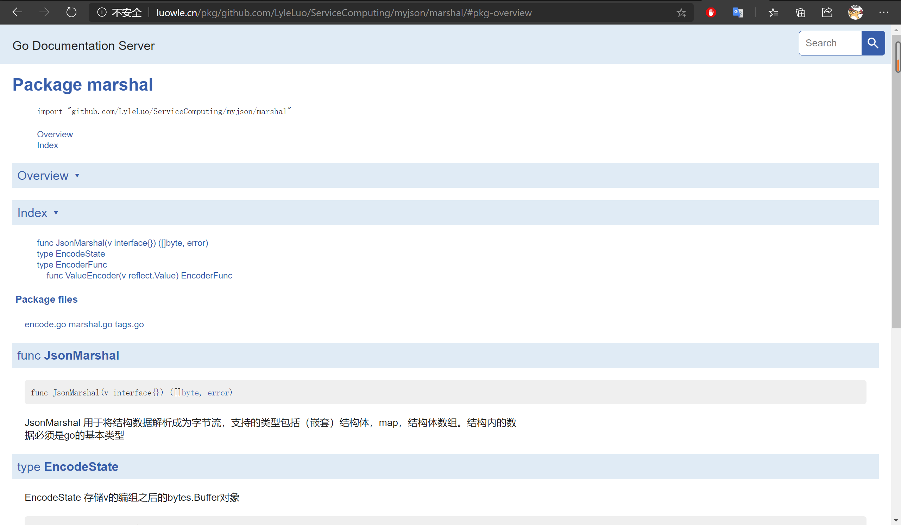

# 中山大学第五次作业
## 简单介绍
1. 该 package 实现了将结构数据解析为JSON
2. 数据类型可以包括结构体（可以嵌套）、map、结构体数组
3. 结构体可以使用自己定义的 tag

## 使用文档
打开 godoc
```
[root@VM_0_4_centos luowle]# godoc -http=:80
using GOPATH mode
```

使用 luowle.cn 即可访问（由于服务器在境内，害怕被查水表，现已关闭在线文档服务）

## 使用说明
### 函数定义
```go
// JsonMarshal 用于将结构数据解析成为字节流，支持的类型包括（嵌套）结构体，map，结构体数组。结构内的数据必须是go的基本类型
func JsonMarshal(v interface{}) ([]byte, error)
```

### 函数返回值
函数会返回两个值
1. 第一个返回值 []byte 返回的是解析后的JSON内容，如果解析过程中出错则会返回 nil
2. 第二个返回值 error 返回的是解析过程中出错的内容，如果没有错误则会返回nil

### 使用例子
主函数如下所示
```go
package main

import (
	"fmt"
	"log"

	"github.com/LyleLuo/ServiceComputing/myjson/marshal"
)

func main() {
	type Watcher struct {
        // 自己实现的 tag
		PeopleName string `json:"name"`
		Sex        string
	}

	// 可以传入各种（嵌套）结构体（数组）或者map
	w := Watcher{"pml", "male"}

	data, err := marshal.JsonMarshal(w)
	if err != nil {
		log.Fatalf("JSON marshaling failed: %s", err)
	}
	fmt.Printf("%s\n", data)
}

```
运行结果如下
```
[luowle@VM_0_4_centos myjson]$ go run main.go 
{"name":"pml","Sex":"male"}
```