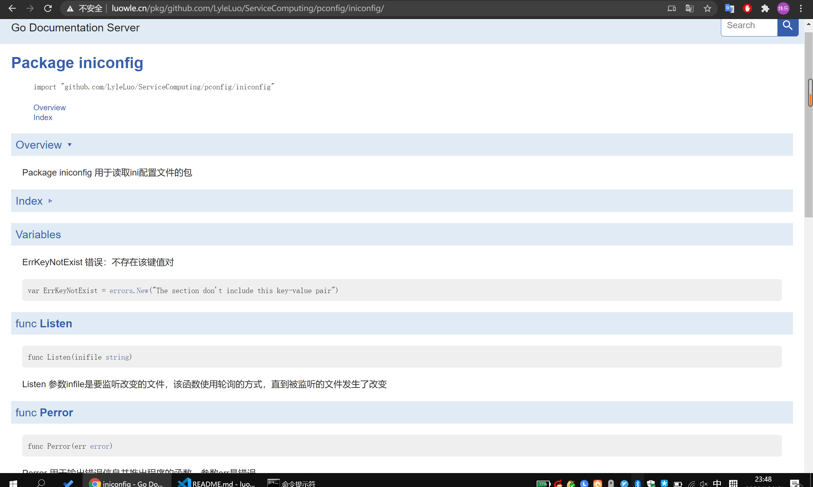

# 中山大学第四次作业
## 简单介绍
1. 该 package 实现了对 ini 配置文件的读取
2. 输入 listener 一个特殊的接口，用来监听配置文件是否被修改，让开发者自己决定如何处理配置变化

## 使用文档
打开 godoc
```
[root@VM_0_4_centos luowle]# godoc -http=:80
using GOPATH mode
```

使用 luowle.cn 即可访问（由于服务器在境内，害怕被查水表，现已关闭在线文档服务）

## 使用说明
### 函数定义
```go
type Listener interface {
	listen(inifile string)
}

// Watch 用来监听文件改变的函数，filename是文件路径，listener是接口，返回一个储存文件信息的map[string]map[string]string和错误类型error
func Watch(filename string, listener Listener) (map[string]map[string]string, error) {
	listener.listen(filename)
	c, err := InitConfig(filename)
	if err != nil {
		Perror(err)
	}
	return c.Conflist, err
}

```
### Watch返回值的使用
```ini
[paths]
data = /home/git/grafana
```
第一个 string 对应上面的 paths，第二个 string 对应上面的 data，第三个 string 对应着 /home/git/grafana
```go
map[string]map[string]string
```

## 使用例子
1. 使用结构体式接口
```go
func (c *Config) listen(inifile string) {
    方法实现
}

func main() {
    // InitConfig 返回一个*Config和错误
	c1, err := iniconfig.InitConfig("test.ini")
	m1 := c1.Conflist
	if err != nil {
		iniconfig.Perror(err)
	}
    fmt.Println(m1)
    
    // c1 *Config 实现了 listen 方法，因此可以传入 Watch
	m2, err := iniconfig.Watch("test.ini", c1)
	if err != nil {
		iniconfig.Perror(err)
	}
	fmt.Println(m2)
}
```

2. 使用函数式接口
```go
func Listen(s string) {
    函数实现
}

func main() {
	var f iniconfig.ListenFunc = Listen
	m2, err := iniconfig.Watch("test.ini", f)
	if err != nil {
		iniconfig.Perror(err)
	}
	fmt.Println(m2)

}
```